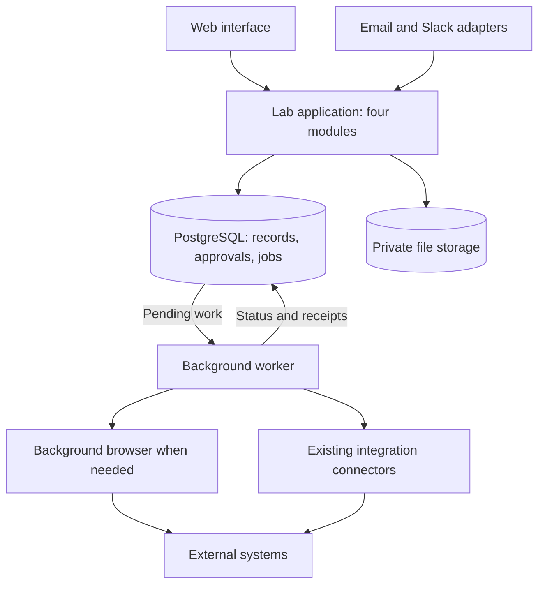

# AdminBot: current architecture → proposed architecture

**Keep the existing lab workflows and useful connectors. Consolidate execution, move SQLite to PostgreSQL, and strengthen authentication and file handling.**

## Current → Proposed → Why

Today, the portal/chat reaches an API and shared workflow service backed by SQLite. Scheduled scripts also manage state and call integrations. The proposal brings those paths into one consistent application and worker flow.

| Area | Current implementation | Proposed decision | Why |
| --- | --- | --- | --- |
| **Application** | Much of the workflow coordination sits in a large [shared service](https://github.com/akhkim/adminbot/blob/d5128d0cab0699723a6e2dca1364e835af7d414b/openclaw-adminbot/extensions/adminbot/src/kernel/service.ts#L2364), alongside separate automation scripts. | Four modules: **People, Research, Requests, Meetings**, sharing tasks and approvals. | Make each workflow easier to change while reusing existing domain logic. |
| **SQLite → PostgreSQL** | [Synchronous SQLite store](https://github.com/akhkim/adminbot/blob/d5128d0cab0699723a6e2dca1364e835af7d414b/openclaw-adminbot/extensions/adminbot/src/persistence/sqlite.ts#L133). [Host](https://github.com/akhkim/adminbot/blob/d5128d0cab0699723a6e2dca1364e835af7d414b/openclaw-adminbot/extensions/adminbot/host/main.ts#L805) and [email script](https://github.com/akhkim/adminbot/blob/d5128d0cab0699723a6e2dca1364e835af7d414b/openclaw-adminbot/scripts/adminbot-email-automation.ts#L1610) have different default database paths. | One PostgreSQL database with shared configuration and asynchronous data access. | Coordinate concurrent web/worker writes and centralize records, constraints, and recovery. |
| **Password security** | [Salted scrypt hashes](https://github.com/akhkim/adminbot/blob/d5128d0cab0699723a6e2dca1364e835af7d414b/openclaw-adminbot/extensions/adminbot/src/workflows/identity/auth.ts#L1254); [seeding](https://github.com/akhkim/adminbot/blob/d5128d0cab0699723a6e2dca1364e835af7d414b/openclaw-adminbot/scripts/adminbot-seed-member-passwords.ts#L277) can give multiple users the same starting password. | Maintained email/password authentication with **Argon2id**, individual enrollment, reset links, and login rate limits. | Standardize credential handling and remove shared starting credentials. |
| **Sessions** | [Tokens saved in localStorage](https://github.com/akhkim/adminbot/blob/d5128d0cab0699723a6e2dca1364e835af7d414b/openclaw-adminbot/ui/src/ui/adminbot/auth/session.ts#L2844); [session cookie omits Secure](https://github.com/akhkim/adminbot/blob/d5128d0cab0699723a6e2dca1364e835af7d414b/openclaw-adminbot/extensions/adminbot/src/api/server.ts#L5605). | HTTPS, Secure/HttpOnly cookies, server-held sessions, immediate revocation. | Reduce reusable-token exposure and reliably terminate access. |
| **Background work** | API operations and [scheduled scripts](https://github.com/akhkim/adminbot/blob/d5128d0cab0699723a6e2dca1364e835af7d414b/openclaw-adminbot/scripts/adminbot-email-automation.ts#L1343) each perform external work. | PostgreSQL-backed jobs and one worker implementation for slow operations. | Give retries, progress, and restart recovery one consistent mechanism. |
| **Approvals and execution** | [Typed actions and execution claims exist](https://github.com/akhkim/adminbot/blob/d5128d0cab0699723a6e2dca1364e835af7d414b/openclaw-adminbot/extensions/adminbot/src/kernel/service.ts#L2364); email automation also has its own effect path. | Save approval and pending work together; process the approved version and record the receipt. | Keep every integration on the same decision path and reconcile uncertain outcomes before retrying. |
| **Files** | Logistics attachments support [base64 contents](https://github.com/akhkim/adminbot/blob/d5128d0cab0699723a6e2dca1364e835af7d414b/openclaw-adminbot/extensions/adminbot/src/workflows/logistics/requests.ts#L91); requests are [stored as JSON](https://github.com/akhkim/adminbot/blob/d5128d0cab0699723a6e2dca1364e835af7d414b/openclaw-adminbot/extensions/adminbot/src/persistence/sqlite.ts#L2873). | Private object storage for file bytes; PostgreSQL for metadata, versions, and access. | Keep large files out of business records and manage uploads/downloads consistently. |

Passwords use **one-way hashing**, while files, secrets, and backups use encryption. Rehash existing passwords after a valid login; require a reset for shared seeded credentials. [OWASP password guidance](https://cheatsheetseries.owasp.org/cheatsheets/Password_Storage_Cheat_Sheet.html).

## Proposed architecture

**People:** profiles and onboarding. **Research:** papers and submissions. **Requests:** reimbursements, travel, letters, signatures. **Meetings:** scheduling and action items.

Each request has an owner, status, next action, and documents. Forms, email, and chat update the same record. AI extracts information and drafts content; application rules control permissions and state changes.

**Work flow:** Request → Prepare → Approve when required → Process → Confirm → Close.

Keep server-side permission checks, authorized file access, encrypted storage/backups, protected secrets, and retained activity records across this flow.

## SQL and NoSQL decisions

- **PostgreSQL tables:** records, relationships, amounts, permissions, approvals, sessions, jobs, and history.
- **PostgreSQL JSONB:** variable form fields and integration metadata. Promote fields into columns when they drive rules or reporting.
- **Private object storage:** PDFs, receipts, manuscripts, letters, and images.
- **Search:** PostgreSQL full-text first; optional pgvector for a demonstrated semantic-search need.
- **Redis:** add only for shared temporary caching/rate limits. Durable work stays in PostgreSQL.

A separate document database adds little here: relational tables plus JSONB cover the current data shapes. PostgreSQL's concurrency model supports the shared application/worker design. [PostgreSQL documentation](https://www.postgresql.org/docs/current/mvcc-intro.html).

## Implementation sequence

1. Introduce PostgreSQL data access, authentication/session changes, and private file storage; rehearse the SQLite import.
2. Move one reimbursement workflow onto shared approvals and durable jobs, then migrate the remaining paths.
3. Pause all old writers, back up, import and reconcile records/files, then switch the application and worker together. Preserve approval hashes and external receipts; reconcile new activity before any rollback.

This is an evolution of the existing application. The proposal retains useful workflows, typed approvals, and connectors while replacing their shared infrastructure.
