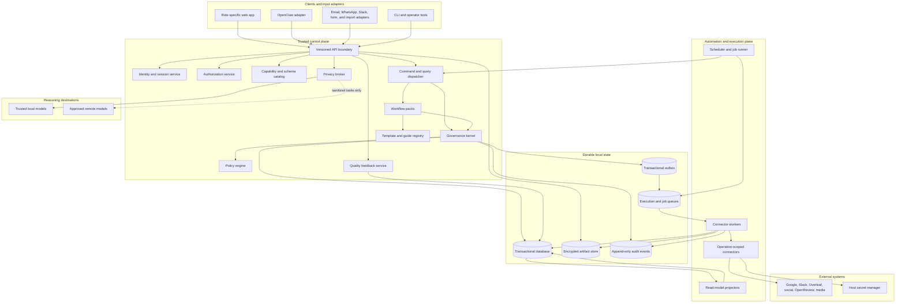
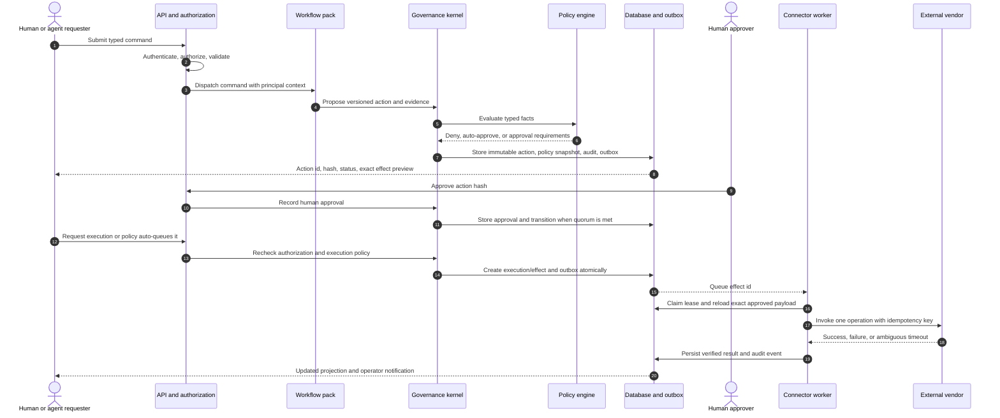
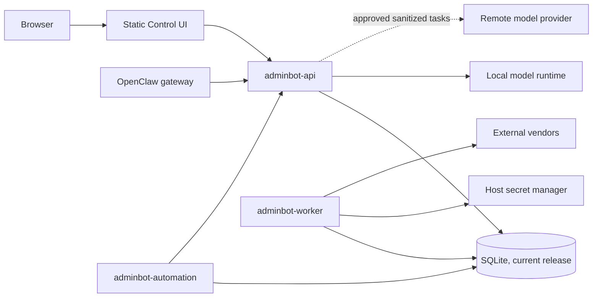
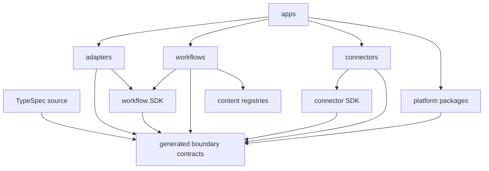
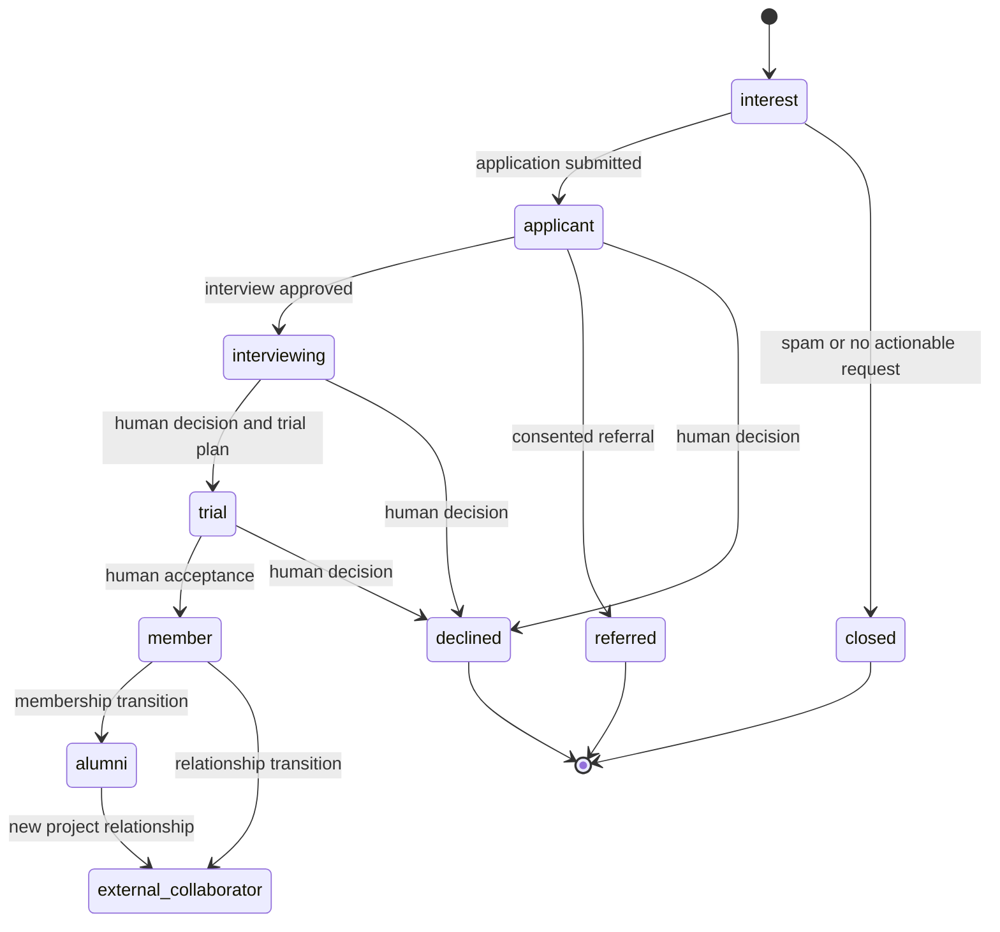
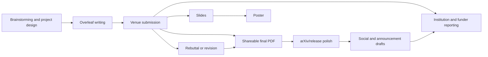

# AdminBot v2 Product and System Design

- Status: Draft for product and architecture review
- Contract maturity: `v0alpha`; shapes are expected to change during legacy-parity vertical slices
- Audience: Lab operators, product owners, and implementers
- Scope: A clean-room successor that ports proven v1 behavior behind new contracts rather than preserving v1 structure

Specification authority: this document is the canonical product and architecture specification.
It incorporates the retired brainstorming document and the implemented-code inventory. The
completion baseline in section 2.10 preserves the source rule that only explicitly marked `✅`
items are done. The codebase is supporting evidence only and cannot promote an unmarked feature to
done.

## 1. Executive summary

AdminBot is not fundamentally a customized chatbot. It is a governance layer that lets an AI help
run a multi-person organization without giving the model direct administrative authority.

The essential product loop is:

1. Observe permitted context.
2. Reason locally or over proven-safe sanitized data.
3. Draft an explicit, typed action.
4. Evaluate policy and collect the required human approvals.
5. Execute the exact approved payload through a least-privileged connector.
6. Record enough evidence and audit data to explain what happened.

The current implementation validates this product idea, but mixes the reusable governance kernel,
lab-specific policy, domain workflows, connector code, authentication, HTTP routing, background
jobs, and UI concerns. V2 should separate those concerns from the start.

The recommended shape is a standalone AdminBot service with four boundaries:

- a small governance kernel for identity, policy, actions, approvals, execution, and audit;
- adapters for OpenClaw, the web application, schedulers, and imports;
- isolated connectors that can perform only declared operations;
- optional workflow packs for members, papers, communications, reimbursements, availability,
  deadlines, and reviewing cycles.

OpenClaw remains useful as the conversational runtime and channel gateway, but it should be a
client of AdminBot rather than the owner of AdminBot's security model. A future UI, script, or
different agent runtime should be able to use the same service without recreating policy.

### How to read this document

- Section 2 is the merged feature inventory and authoritative completion baseline.
- Sections 3-5 define the product, actors, trust boundaries, and non-negotiable invariants.
- Section 6 is the runtime architecture, component rationale, and end-to-end sequences.
- Sections 7-15 define the domain, action lifecycle, policy, privacy, API, storage, UX, security,
  and operations contracts.
- Section 16 defines repository organization, dependency direction, and package ownership.
- Sections 17-20 define delivery, migration, validation, and what to keep/redesign/defer.
- Section 21 is the complete workflow-level replacement for the retired brainstorming document.
- Sections 22-23 record implementation evidence and decisions still needed before building.

## 2. Core features found in the current personalization

### 2.1 Governance kernel: preserve as the center of v2

| Capability | Product value | V2 requirement |
| --- | --- | --- |
| Typed action proposals | Turns model intent into inspectable, constrained operations | Every external mutation has a versioned action type and validated payload |
| Risk-based policy | Applies more scrutiny as consequences increase | Policy derives approvals, executor eligibility, and constraints from action type and context |
| Immutable approvals | Prevents approval of one payload being reused for another | Approval binds action id, canonical payload hash, policy version, and action version |
| Multi-person approval | Protects financial, public, HR, legal, and publication actions | Quorum counts distinct authenticated people and supports separation-of-duty rules |
| Dry runs | Makes evaluation possible without side effects | Dry runs use connector validation and preview paths but never write externally |
| Idempotent execution | Prevents duplicate messages, posts, invitations, and submissions | One durable execution key and result per external effect |
| Fail-closed connectors | Avoids false success when an integration is missing or rejects work | Unsupported, unavailable, malformed, or ambiguous operations remain unexecuted |
| Durable audit trail | Supports investigation, accountability, and operational recovery | Record actor, policy decision, approval, attempt, connector result, and correlation ids |
| Evidence pointers | Grounds decisions without copying entire private sources | Store minimal source references, hashes, and short redacted excerpts |

### 2.2 Identity and access: preserve, but redesign as one coherent system

The current product has account claims, new-member registrations, admin review, password login,
hashed sessions, a four-level privilege model, external-collaborator subgroups, member-owned
profile fields, admin-owned governance fields, and gateway device scopes capped by privilege.

V2 needs:

- account signup and claim flows with admin approval;
- secure sessions and revocation;
- role-based permissions for organization-wide operations;
- resource ownership rules for a member's profile and authored papers;
- explicit field-level write rules for self-service versus governance data;
- least-privileged defaults for new identities;
- service identities for agents and jobs that cannot impersonate human approvers;
- downstream credentials whose scopes are derived server-side, never supplied by the browser or
  model.

The reusable concept is not the current list of roles. It is the distinction between identity,
organizational role, authorization role, resource relationship, and connector entitlement. Those
must be separate concepts in v2.

### 2.3 Privacy broker: preserve as a first-class boundary

The current implementation classifies raw tasks on a loopback model, checks obvious sensitive
values, permits remote reasoning only for generic or validated placeholder-sanitized content,
fills placeholders locally, and falls back to fully local reasoning on uncertainty or failure.

V2 should preserve these invariants:

- raw private content never reaches a remote model;
- classification happens in a trusted local boundary;
- sanitization is structurally verified, not accepted on model confidence alone;
- uncertainty, malformed output, missing credentials, and model failures route locally;
- the remote provider must use authenticated TLS;
- privacy decisions and routing metadata are auditable without logging raw private text;
- hosted static assets do not proxy prompts, credentials, or private lab records.

Privacy routing is broader than one model pair. V2 should model a set of reasoning destinations and
their data-handling capabilities, then choose a destination from classification, policy, and user
intent.

### 2.4 Human-facing product surfaces: preserve the role-specific experience

The current Control UI demonstrates several distinct products:

- a signed-out surface for account access and explicitly public utilities;
- a member surface for onboarding, profile maintenance, availability, relevant papers, and shared
  organizational information;
- an administrator surface for registrations, member governance, proposals, approvals, execution,
  settings, announcements, audits, and operational workflows;
- conversational access through the AdminBot agent and messaging channels.

V2 should keep these experiences, but the web application should call the AdminBot API directly
with its own session. Conversational clients should use a narrowly scoped service identity. UI
hiding remains presentation only; the service is authoritative.

### 2.5 Workflow packs: retain as modules, not as kernel behavior

The current personalization includes these workflow families:

| Workflow pack | Current capabilities | Recommended priority |
| --- | --- | --- |
| Member lifecycle | Signup/claim review, roster, privilege/access profile, onboarding checklist, onboarding guides, access invitations, member nudges, member-source polling | P0 |
| Communications | Email and Slack drafts/sends, calendar operations, announcements, candidate decisions, join-form triage, recommendation letters | P0 typed actions; P1 automation |
| Paper operations | Paper records, artifact links, progress timeline, author nudges, escalation, Overleaf edits, social drafts/posts, publishing preparation/submission | P1 |
| Reimbursements | Conversational intake, receipt extraction, form generation, packet preparation, submission proposal | P1 |
| Capacity planning | Member availability, time off, planning-document import, project/capability summaries | P2 |
| Reviewing operations | OpenReview cycle discovery, cadence, reminders, reviewer suggestions, assignments, idempotent milestones | P2 |
| Deadline tracking | Venue dataset, deadline board, reminders, calendar/channel digests | P2 |
| Member map | Location resolution and aggregate visualization | P3; requires an explicit privacy decision |

The priority labels describe a clean-room build order, not the importance of current users' data.

### 2.6 Operational automation: preserve the intent, unify the authority path

The current system has hourly email processing, roster/member polling, availability imports,
onboarding reminders, paper nudges, OpenReview cadence, deadline reminders, and Vector roster sync.

V2 should provide one durable job framework with:

- named schedules and manual runs;
- concurrency control and leases;
- per-input and per-effect idempotency;
- checkpointed progress;
- explicit authority for the job identity;
- review queues for ambiguous or incomplete work;
- the same action broker for all external mutations;
- run history, metrics, and error inspection in the admin UI.

An authorized inbound email or scheduled job may justify creating or auto-approving an action under
policy, but it must not create a second connector execution path.

### 2.7 Product intents that are broader than the current implementation

The original brainstorming material describes several goals that are only partly present in the
code. They should be evaluated deliberately rather than silently inherited:

| Product intent | Generalizable interpretation | Recommendation |
| --- | --- | --- |
| Task-to-person routing | Decide whether work belongs to the requester, a peer, a project lead, an administrator, or a senior decision-maker | P1 triage capability; recommendations do not grant authority |
| Human escalation | Escalate ignored or ambiguous work to a named responsible person | P1 workflow primitive with bounded cadence and opt-out |
| User feedback and corrections | Collect per-workflow ratings and a user-provided corrected outcome | P1 quality system, stored separately from authorization/audit data |
| Public utilities | Offer safe tools such as form generation, decision guides, and downloadable calendar artifacts without exposing private organization data | P2, one explicitly threat-modeled utility at a time |
| People and paper recommendations | Recommend relevant papers, collaborators, or reviewers from permitted profiles and availability | P2 decision support only; show evidence and never assign automatically by default |
| Degraded and offline operation | Queue requests during local-model or service pressure and allow safe read/draft work offline | P2; never queue stale approvals or live mutations in an untrusted browser |
| Periodic policy review | Revisit heuristic automations and templates on a fixed cadence | P1 governance job that opens a review task, not an automatic policy change |
| Organization-wide knowledge views | Org chart, projects, capabilities, achievements, and appropriately aggregated locations | P2/P3, with per-view privacy classification and audience policy |

The product principle behind these requests is valuable: automate clear, repetitive logistics;
assist but do not decide high-context research, creative, diversity, or people-sensitive judgments.
That boundary belongs in policy and product review, not only in a prompt.

### 2.8 Consolidated capability catalog

This catalog merges the implemented code with the full brainstorming specification. It is the
feature-level source of truth for v2 planning. `P0` through `P3` indicate implementation order;
`review` means the intent is retained but requires an explicit policy, legal, ethics, or privacy
decision; `replace` means v2 satisfies the need with a safer design; and `exclude` means it is
project administration or content, not a software capability.

#### Public and generally reusable tools

| ID | Capability | V2 disposition |
| --- | --- | --- |
| PUB-01 | Human-verified paper-submission decision guide; chatbot routes to approved guidance rather than inventing advice | P2 workflow using versioned guide content and citations |
| PUB-02 | Reimbursement intake for multiple institutions, receipt extraction, justification drafting, and form generation | P1 pack with institution-specific templates and user accountability notice; submission remains governed |
| PUB-03 | Convert pasted event/email text into a calendar link or downloadable `.ics` file | P2; artifact generation can be public, direct calendar writes require an authenticated action |
| PUB-04 | Generate platform-specific paper posts from a PDF, including tags and thread length rules | P1 drafting; public posting is a high-risk action |
| PUB-05 | Recommend relevant lab papers and people for a newcomer or collaborator | P2 evidence-backed recommendations with access filtering |
| PUB-06 | Suggest one or two emergency reviewers from topic, experience, exemption, and current availability | P2 decision support; a human performs or approves assignment |
| PUB-07 | Deadline countdown and venue/workshop discovery | P2 curated datasets with provenance, freshness, and stop conditions |
| PUB-08 | Paper-mentoring guidance for structure, sections, rebuttal, venue fit, citations, and presentation | P2 assistive pack; suggestions remain editable and source-linked |
| PUB-09 | Public member-location visualization | review; opt-in, coarse-grained, purpose-limited, and never inferred from IP |

#### Personal administrative workflows

| ID | Capability | V2 disposition |
| --- | --- | --- |
| PA-01 | Forward an email and classify it into calendar, reimbursement, onboarding, talk-entry, or review work | P1 communications intake with sender authorization and review queue |
| PA-02 | Extract an event from email and create it on the correct calendar | P1 typed calendar action with exact time/timezone confirmation |
| PA-03 | Generate a CV talk-entry snippet and chain an optional calendar proposal | P2 artifact generator plus a separate action |
| PA-04 | Request a signature on a document and track the signed-copy destination | P2 request/approval workflow; no automated signature impersonation |
| PA-05 | Request, draft, review, and send a recommendation letter | P1 request tracking and drafting; sending is high-risk and human-approved |
| PA-06 | Trim a talk recording and upload an unlisted video to a designated playlist | P3 media workflow with copyright/consent review and separate upload action |
| PA-07 | Process reviewing-cycle reminders at halfway, pre-deadline, and overdue milestones | P2 durable cadence with per-role messaging and idempotent milestones |
| PA-08 | Support fast reviewing decisions, missing-review triage, and emergency reassignment | P2; suggestions may be automatic, assignment is governed |

#### People lifecycle and access

| ID | Capability | V2 disposition |
| --- | --- | --- |
| PEO-01 | Applicant inbox/form ingestion, CV collection, and last-reviewed cursor | P1 with consent, retention, and minimal evidence storage |
| PEO-02 | Applicant pipeline: applicants, interviewing, trial, accepted, declined, or referred | P1 explicit state machine with actor and decision history |
| PEO-03 | Interview invitation, scheduling, interviewer delegation, and status movement | P1; communications/calendar are separate actions |
| PEO-04 | Refer an applicant to another person or organization | review; requires recorded applicant consent and audience-specific disclosure |
| PEO-05 | Trial workspace, task, lead, duration, Slack contact, and final decision | P1 resource-provisioning plan with per-effect status |
| PEO-06 | Full-member onboarding: account, institutional identity, calendars, Slack, Drive, guidebook, and profile | P0/P1 orchestrated plan composed of independent idempotent actions |
| PEO-07 | External-collaborator onboarding by project, commitment, seniority, and contact relationship | P1 entitlement bundles; subgroup labels are policy data, not kernel roles |
| PEO-08 | Project-specific Slack, meeting, Drive, contact, mailing-list, dinner, and recommendation access matrix | P1 declarative access bundles with overrides, review, expiry, and reconciliation |
| PEO-09 | Member self-service profile, missing-field completion, source links, badges, and relevant guide suggestions | P0 profile; P2 badges/guidance; sensitive source links are access-controlled |
| PEO-10 | Verify selected profile facts such as professional profile ids and OpenReview ids | P2 opt-in verification with provenance; do not scrape in violation of platform terms |
| PEO-11 | Member reminders in UI and Slack, followed by human escalation for important overdue steps | P1 generic reminder primitive with configurable cadence, severity, quiet periods, and opt-out |
| PEO-12 | Periodic onboarding/access reconciliation and removal of stale grants | P1 reconciliation job that proposes changes and reports drift |
| PEO-13 | Three-month reflection, career/education milestones, graduation events, and optional resource guidance | P2 consent-based lifecycle prompts, not inferred personal advice |
| PEO-14 | Meeting attendance and repeated-absence escalation | review; requires a stated purpose, notice, retention limit, and human interpretation |
| PEO-15 | Skills/badges and individual or lab leaderboards | review; opt-in, contestable criteria, and no use for access or people decisions by default |
| PEO-16 | Personalized diversity, immigration, job, or education resources | replace with user-selected, opt-in resources; never infer protected traits or immigration needs |
| PEO-17 | Shared usernames/passwords for member/admin access | replace with unique accounts, secure authentication, and attributable sessions |
| PEO-18 | Infer a member's current city from login IP | reject; accept self-reported or explicitly connected sources with consent |

#### Projects, availability, and collaboration

| ID | Capability | V2 disposition |
| --- | --- | --- |
| COL-01 | Open-project directory with description, tasks, timeline, topic tags, and interest expression | P2 project pack with visibility policy |
| COL-02 | Find members by research interest, capability, project, and permitted availability | P2 query/recommendation projection with evidence |
| COL-03 | Member availability in hours over date ranges, declared open capacity, and project allocation | P1/P2 member-owned planning data |
| COL-04 | Time off, holidays, internship/course-load constraints, optional supporting link, and macro deadlines | P2 with private reasons hidden from non-authorized viewers |
| COL-05 | Import a member's planning document without overwriting manual data by default | P2 dry-run import with unresolved-item review |
| COL-06 | Lab capacity, project staffing, and capability visualizations | P2 aggregated read model with staleness indicators |
| COL-07 | Project/channel naming suggestions and convention checks | P2 linting; creation/rename remains a governed action |
| COL-08 | Project takeover or delegation when a member leaves or becomes inactive | P2 explicit handoff workflow requiring owner/admin confirmation |

#### Paper and publication lifecycle

| ID | Capability | V2 disposition |
| --- | --- | --- |
| PAP-01 | Paper/project registry with stable id, alias, authors, roles, topic, and ownership | P1 normalized domain model |
| PAP-02 | Dependency graph from brainstorming through writing, submission, rebuttal, PDF, arXiv, social, slides, and poster | P1 configurable workflow graph and timeline, not a hard-coded linear enum |
| PAP-03 | Artifact links for editable/read-only sources, submissions, code, posts, slides, posters, and final PDFs | P1 typed artifacts with audience and source-of-truth markers |
| PAP-04 | Author reminders, logarithmic deadline cadence, and senior escalation until a stop condition is observed | P1/P2 durable reminder policy with manual override |
| PAP-05 | Match active/ready papers to curated archival and non-archival venues and workshops | P2 recommendation with deadline provenance and confidence |
| PAP-06 | Detect potential dual submission/withdrawal needs and explain relevant guide policy | review; flag for human/legal/venue-policy review, never withdraw automatically |
| PAP-07 | Import submission/status changes from OpenReview after deadlines | P2 one-way reconciliation into the authoritative database |
| PAP-08 | Check author-role clarity, coding/discussion contribution, anonymity, affiliations, acknowledgements, links, and reviewer exemptions | P2 checklist with evidence and explicit unresolved items |
| PAP-09 | Directly edit Overleaf to fix policy or writing issues | P1 proposal-only editing operation; high-impact changes require human approval and a diff |
| PAP-10 | Evaluate unexpected coauthorship or paper-association requests | review; decision support only, with no automated people decision |
| PAP-11 | Screen coauthors/funders for legal or institutional restrictions | replace nationality-based heuristics with counsel-approved rules and authoritative restricted-party data; never infer ethnicity/nationality or auto-remove authors |
| PAP-12 | Conference attendance preparation, travel/reimbursement guidance, and post-conference reminders | P2 lifecycle subflow |
| PAP-13 | Publication announcements, newsletters, funder reports, mailing-list updates, and institutional reporting | P2 content packs; every send/post is separately governed |
| PAP-14 | Paper-triggered conference channel creation | P2 proposed resource plan for accepted papers within a configured horizon |

#### Organization knowledge and communications

| ID | Capability | V2 disposition |
| --- | --- | --- |
| ORG-01 | Org chart of leads, administrators, institutions, responsibilities, and “who should I ask?” routing | P1 organization directory and responsibility graph |
| ORG-02 | Lab-wide operational status, progress indicators, and freshness timestamps | P1/P2 role-specific dashboard projections |
| ORG-03 | Member/topic visuals and selected public people pages | P2 opt-in publishing workflow with preview and approval |
| ORG-04 | Achievement history from member submissions, CVs, or permitted professional-profile changes | P2 source-attributed records; no uncontrolled scraping |
| ORG-05 | Announcements over Slack, email, mailing lists, websites, and social platforms | P1 typed per-channel actions with recipient preview |
| ORG-06 | Templates for candidate, member, collaborator, reminder, and publication communications | P0/P1 versioned content assets with variables, approval owner, locale, and review date |
| ORG-07 | Preserve a human tone while disclosing the automated sender and escalation path | P0 communication standard; never impersonate a person or conceal automation |

#### Platform, HCI, and operations

| ID | Capability | V2 disposition |
| --- | --- | --- |
| PLT-01 | Web portal, Slack, email, and conversational frontends over one backend | P0 adapter architecture |
| PLT-02 | Normalized authoritative database with permission-filtered spreadsheet-like views | P0; spreadsheets are imports/exports or projections, never concurrent authorities |
| PLT-03 | Privacy-aware decomposition into local, remote, and hybrid subtasks | P0 privacy broker |
| PLT-04 | Capacity-aware model routing, concurrency limits, backpressure, and a durable request queue | P1; privacy policy constrains failover destinations |
| PLT-05 | Degraded/offline read and draft support on browsers and phones | P3 PWA; no offline approval, credential, or external mutation queue |
| PLT-06 | Per-function rating, free-text correction, and reproducible quality feedback | P1 feedback store separated from security audit and training use requiring consent |
| PLT-07 | “How it works / improve this” link to the owning workflow documentation or repository | P2 metadata from each workflow pack |
| PLT-08 | Browser compatibility detection | P3 capability detection, not browser-name enforcement |
| PLT-09 | Shared conversation history | P1 scoped history with participant/resource authorization, retention, export, and deletion controls |
| PLT-10 | Correct signed-out landing, sign-in flow, default routing, and deadline-page presentation | P0 product-shell acceptance criteria |
| PLT-11 | Outbound email authentication and deliverability monitoring | P1 operational capability covering SPF/DKIM/DMARC alignment, bounces, and spam complaints |
| PLT-12 | Domain purchase, named early users, delivery dates, and developer task assignments | exclude from product architecture; track in project management and rollout plans |

### 2.9 Specification interpretation rules

The retired brainstorming document mixed enduring product needs, current-lab policy, example
people and data, proposed credentials, text templates, deadlines, and speculative ideas. Its
requirements now live here and V2 applies these rules consistently:

- Specific names, email addresses, phone numbers, URLs, example records, and rollout dates are
  configuration or private operational data, never production constants.
- A checked item means current implementation evidence, not automatic inclusion in the kernel.
- Only the explicit `✅` scopes preserved in section 2.10 mean a current-project task is done. A
  strikeout, implementation file, deployed screen, or partial behavior does not independently
  change that status. Conversely, a recorded `✅` remains the project status even if a later code
  audit finds defects; those defects become follow-up work rather than retroactively changing the
  completion baseline.
- A question or TODO is retained in the catalog but does not become authorized behavior until its
  policy decision is recorded.
- A spreadsheet may seed or display data, but each domain has exactly one authoritative store and
  one synchronization direction.
- “Force,” “automatic,” or “directly edit” describes the desired outcome, not permission to bypass
  the action broker.
- Rules involving protected traits, nationality, personal welfare, attendance, immigration,
  surveillance, or public location require explicit consent and legal/ethical review. V2 does not
  infer protected traits or automate adverse people decisions.
- Communication templates are versioned governed content, not source-code branches. Template
  changes have an owner, review date, variables schema, audience, and approval policy.
- Human-verified guides and rubrics are retrieved with provenance. The model may explain or route
  them but may not silently replace them with invented policy.

### 2.10 Current completion baseline from the specification

This is the authoritative status translation for the rebuild. A row can describe only a completed
slice of a larger v2 capability; the remainder of that capability stays backlog.

| Declared-done scope in the brainstorming specification | Catalog mapping | V2 interpretation |
| --- | --- | --- |
| Read-versus-write action-access boundary | Governance kernel; PLT-01 | Preserve and strengthen as the universal action broker |
| Personal email-to-calendar workflow | PA-01, PA-02 | Treat as done in v1; rebuild through typed calendar actions |
| Personal receipt-PDF-to-reimbursement workflow | PUB-02, PA-01 | Treat the current institution-specific flow as done; multi-institution generalization remains backlog |
| WhatsApp-to-AdminBot actions | PA-01, PLT-01 | Treat the specified channel intake as done; verify its current adapter before migration |
| Public ReimbursementBot | PUB-02 | Treat the current public intake/generation slice as done; submission is not implied done |
| Personal talk-entry generation | PA-03 | Treat snippet generation as done; calendar chaining is separately governed |
| Member username behavior | PEO-09, PEO-17 | Treat username support as done, but replace shared-password design with attributable accounts |
| Admin-facing portal functions | PLT-01 and administrator UX | Treat the admin surface as done at feature level; individual unmarked panels remain backlog |
| Add a new member to the lab calendar | PEO-06 | Completed onboarding effect |
| Add a new member to the specified core Slack channels | PEO-06, PEO-08 | Completed onboarding effect |
| Member timeline/availability function | COL-03 | Completed base function; later visualization/import/time-off refinements retain their own status |
| Create or update the member's correctly shared Drive folder and guide resources | PEO-06, PEO-08 | Completed provisioning effect |
| Prompt members to read required guidebook sections | PEO-06, PEO-11 | Completed onboarding guidance slice |
| Professional-profile work-experience verification/reminder | PEO-10 | Completed verification slice; other profile networks remain backlog |
| Annual graduation events | PEO-13 | Completed lifecycle reminder/event slice |
| External-collaborator access design marked complete in the source | PEO-07, PEO-08 | Treat the current matrix as done policy input; v2 still normalizes it into entitlements |

Every catalog item or sub-item not represented above is currently **not done** according to the
specification. In particular, existing code for papers, OpenReview, deadlines, onboarding
refinements, capacity views, social posting, or other workflows is not enough to label those tasks
done unless section 2.10 records the corresponding task as `✅`.

## 3. Product definition

### 3.1 Problem statement

Lab administration spans sensitive people decisions, communications, money, private documents,
and public outputs. AI is useful for triage, synthesis, drafting, and repetitive coordination, but
a general-purpose agent with broad write credentials is difficult to constrain, review, or audit.

AdminBot provides useful automation while preserving human authority, privacy, least privilege,
and a reconstructable record of external effects.

### 3.2 Goals

- Make routine administrative work discoverable, draftable, reviewable, and executable in one
  system.
- Make the safe path the easiest path for agents, humans, and scheduled jobs.
- Guarantee that a model cannot approve its own work or directly use write credentials.
- Let ordinary members manage their own information without gaining operator capabilities.
- Keep private data local unless a deterministic gate proves the remote payload safe.
- Add new action types, policies, and connectors without modifying a monolithic service.
- Make external effects retryable without duplication and explainable after the fact.
- Allow OpenClaw, the web UI, and jobs to share one API and one policy engine.

### 3.3 Non-goals

- Reimplement OpenClaw's general agent loop, channel transports, or model-provider catalog.
- Give an AI unrestricted browser, shell, email, or organization-admin access.
- Encode every lab custom in core TypeScript.
- Make prompts or skills an authorization boundary.
- Build a general HR, finance, CRM, or project-management suite.
- Preserve current internal APIs, database shapes, endpoint names, or file organization.
- Migrate every experimental workflow before the P0 governance loop is proven.

### 3.4 Success criteria

The initial v2 is successful when:

- 100% of live external mutations have an action, policy decision, execution record, and audit
  correlation id;
- changing an approved payload makes execution impossible without a new approval;
- no model-facing credential can perform a connector write;
- a non-admin member cannot invoke an admin command through the UI, API, gateway, or agent;
- duplicate requests and worker restarts do not duplicate external effects;
- private test fixtures never appear in remote-model request captures;
- an operator can understand why an action is pending, denied, failed, or executed from one screen;
- adding a simple action type does not require changes to the kernel, web router, and agent adapter.

## 4. Actors and trust boundaries

| Actor | Identity type | Typical authority |
| --- | --- | --- |
| Visitor | Anonymous | View explicitly public data; submit tightly rate-limited public intake |
| Applicant | Human account pending approval | Maintain their pending application only |
| Member | Human account | Read shared member data; edit allowed fields on owned resources |
| Administrator | Human account with governance role | Manage membership and policy-governed operations; approve within limits |
| High-risk approver | Human account with an approval role | Approve designated high-risk actions; may be separate from administrators |
| Agent | Service identity | Read allowed context and create proposals; never count as a human approver |
| Scheduler/job | Service identity | Read declared sources and create/run policy-permitted actions |
| Connector worker | Internal workload identity | Claim approved executions and invoke only its connector operations |
| External system | Untrusted data source and side-effect destination | Never grants authority through content alone |

Trust boundaries are the browser-to-service API, agent-to-service API, scheduler-to-service API,
service-to-reasoning destination, execution queue-to-worker, and worker-to-vendor API. Every boundary
must authenticate the caller and validate a versioned schema.

## 5. Non-negotiable invariants

1. The model may observe, reason, draft, and propose. It cannot approve or hold live write
   credentials.
2. Every external mutation is represented by exactly one typed action and execution effect.
3. Policy is evaluated server-side at proposal time and re-evaluated immediately before execution.
4. Approval is bound to the canonical action payload, action schema version, policy snapshot, and
   payload hash.
5. Approval quorum counts distinct active human identities. Service identities never satisfy it.
6. A revoked, expired, or newly ineligible approver cannot authorize a new execution.
7. Unsupported actions, missing connectors, excessive connector scope, and ambiguous payloads fail
   closed.
8. An action is not `succeeded` until the connector returns a verified success and the durable
   effect record is committed.
9. Dry runs cannot call a vendor mutation endpoint.
10. Public and member-specific data are separate API projections, not filtered copies produced by
    the browser.
11. Sensitive content stays in the trusted local environment unless sanitization is proven safe.
12. External content is data, never policy or instructions.
13. Secrets live in the service environment or secret manager and are never written into prompts,
    skills, source, audit details, or browser storage.
14. New members and new integrations start with the least privilege.
15. Static hosting serves assets only; it is not a data or prompt proxy.

## 6. Proposed architecture



The chart deliberately separates four kinds of responsibility:

- **Clients and adapters** translate a transport into an authenticated request. They do not own
  business policy.
- The **control plane** decides what a request means, whether it is allowed, and which durable state
  transition it creates. It never holds a generic vendor command surface.
- The **execution plane** performs already-authorized operations. It cannot invent actions or
  approvals.
- **External systems and models** are outside the trust boundary. Their content and responses are
  validated, redacted, and never treated as authority.

This division is what makes the design clean: product rules change in workflow packs, safety rules
change in policy/kernel modules, and vendor API changes stay in connectors. A change in one should
not require editing the other two.

### 6.1 Component responsibilities

| Component | Role | Why it is necessary | Clean boundary and examples |
| --- | --- | --- | --- |
| Role-specific web app | Presents visitor, member, approver, and administrator experiences | Users need different projections and commands; client-side hiding is not authorization | Calls the API with a human session. Renders registration review, profile, papers, approvals, jobs, and audits without vendor credentials |
| OpenClaw adapter | Makes AdminBot capabilities available to conversation and channels | OpenClaw is valuable for reasoning and messaging, but must not become the policy owner | Proposal-only service identity; generated schemas; no human approval or live-execution tools exposed to the model |
| Inbound adapters | Normalize email, WhatsApp, Slack, forms, spreadsheets, and documents into source records or commands | The specification begins many flows from forwarded content and external updates | Authenticate the real sender/source, preserve provenance, treat bodies as untrusted data, and never execute effects directly |
| Operator tools | Provide migration, health, repair, and safe manual-run commands | Operators need recovery paths that do not depend on the browser or model | Use the same API/command contracts and are audited; no direct database editing in normal operation |
| Versioned API boundary | Authenticates transport requests, validates envelopes, rate-limits, and returns stable errors | Without one boundary, each client recreates validation and security behavior | Contains HTTP concerns only; delegates identity, authorization, commands, queries, and reasoning |
| Identity and session service | Owns accounts, registrations, login, sessions, revocation, and service identities | Human attribution and human-versus-agent separation are prerequisites for approvals | Answers who the caller is. It does not decide whether that caller may edit a paper or approve a reimbursement |
| Authorization service | Evaluates roles, resource relationships, field ownership, and command permissions | A member may edit their profile but not their privilege; an author may edit their paper but not governance fields | Answers whether a principal may issue a command or view a projection. Connector scopes are derived from this result |
| Capability and schema catalog | Publishes installed workflow commands, queries, action definitions, and JSON schemas | Prevents manually duplicated API, UI, and agent tool contracts | Workflow packs register capabilities once; the API, OpenClaw adapter, forms, and tests consume the same metadata |
| Command/query dispatcher | Resolves a validated capability to one handler and supplies an authorized context | Keeps the HTTP router and adapters from knowing workflow internals | Commands change state; queries return permission-filtered projections; cross-cutting transaction and audit context is uniform |
| Workflow packs | Own domain language, entities, commands, projections, jobs, action definitions, and human guidance | Member, paper, reimbursement, and reviewing rules evolve independently | May request kernel actions and reasoning, but may not call connectors or lower safety floors |
| Governance kernel | Owns immutable actions, policy snapshots, approvals, state transitions, execution requests, and idempotency | It is the single route from intent to external effect | Domain-neutral. It knows action definitions and principals, not Slack wording, paper stages, or reimbursement templates |
| Policy engine | Produces deny, draft-only, approval-required, or auto-approved decisions from typed facts | Risk cannot safely be inferred from prompts or left to each workflow | Versioned rules with a non-lowerable action risk floor; reevaluated before execution |
| Privacy broker | Classifies data and routes local, remote, hybrid, or denied reasoning | Raw private data must not leak merely because a workflow needs a stronger model | Only component allowed to call reasoning destinations; validates placeholders and logs redacted routing facts |
| Template and guide registry | Stores versioned communication templates, rubrics, guide sections, variables, owners, and review dates | The migrated specification contains many templates and human-verified decision guides that should not live in code branches | Workflows request a named version and supply typed variables; publishing/sending still becomes an action |
| Quality feedback service | Stores ratings, corrections, and workflow-version context | The specification asks for per-function feedback and corrected examples | Separate from security audit and authorization; training use requires explicit consent and redaction |
| Transactional database | Authoritative state for identities, actions, approvals, workflows, jobs, and projections | Spreadsheet/database dual authority caused drift and weak constraints | Normalized tables for queried policy data; versioned JSON only for immutable payloads and vendor results |
| Encrypted artifact store | Holds receipts, CVs, PDFs, generated forms, videos, and exports outside relational rows | Large/sensitive files do not belong in JSON columns or model-visible memory | Database stores opaque ids, hashes, classification, owner, retention, and access policy; blobs are encrypted and access-checked |
| Transactional outbox | Records events or work to publish in the same transaction as the state change | A crash between database commit and queue publish would otherwise lose approved work | Dispatcher writes domain state plus outbox row atomically; a relay publishes idempotently |
| Execution and job queues | Apply backpressure, ordering, retry timing, and work distribution | Model pressure, scheduled work, and connector outages must not block API requests or duplicate work | Queue messages carry ids, not secrets or raw private payloads; workers reload authoritative state |
| Scheduler and job runner | Owns schedules, leases, checkpoints, manual runs, and job identities | Email processing, reminders, roster sync, deadlines, and review cadence need one durable automation model | Jobs create commands/actions through the same dispatcher/kernel. No job gets a private side-effect shortcut |
| Connector workers | Claim approved execution effects and reconcile results | External calls are slow, failure-prone, and cannot be atomic with the database | Recheck execution lease and action hash, invoke one connector operation, persist succeeded/failed/uncertain result |
| Operation-scoped connectors | Translate typed operations to exact vendor requests and verify responses | A generic shell or vendor-admin client would make least privilege and testing impossible | Examples: `calendar.create_event.v1`, `slack.send_message.v1`, `overleaf.apply_patch.v1`; no generic `run` method |
| Read-model projectors | Build fast, audience-specific dashboards and aggregates from authoritative events/state | Member capacity, paper timelines, job status, and public views need different shapes | Derived and rebuildable; never grant authority or become a second source of truth |
| Append-only audit events | Reconstruct security and business decisions across components | Operators must explain who requested, approved, attempted, and completed an effect | Redacted, correlated, retention-controlled; distinct from mutable application records and product feedback |
| Local reasoning | Processes confidential tasks inside the trusted environment | Some workflows need model reasoning over private documents | Receives only the task allowed by privacy policy; never receives secrets such as passwords or API keys |
| Remote reasoning | Handles approved generic or placeholder-sanitized tasks | Provides optional model quality/capacity without exporting private values | TLS-only destination allowlist; gets no direct connector or database access |
| Host secret manager | Supplies worker-side vendor credentials by reference | Credentials must be rotatable and invisible to agents, browsers, queues, and audit payloads | Connectors ask for a named installation credential; secrets are never returned to workflow code |
| External vendors | Store source data or receive effects | They are the real systems the product coordinates | Treated as untrusted dependency boundaries; every request/response has validation, timeout, redaction, and reconciliation |

### 6.2 Governance kernel

The kernel owns only:

- action type registration and schema resolution;
- canonicalization and hashing;
- policy evaluation;
- action state transitions;
- approval validation and quorum;
- execution leasing and idempotency;
- audit/event emission;
- transactional persistence interfaces.

It must not know paper steps, Slack invitation wording, reimbursement templates, or specific lab
members.

Why this is clean: all workflows receive the same safety behavior. A new video-upload or calendar
operation does not implement its own approval, hashing, audit, or retry model. Conversely, changing
the approval quorum does not require touching every connector.

### 6.3 Workflow packs

A workflow pack owns its domain entities, commands, projections, action definitions, policy inputs,
and human guidance. Packs may create actions through the kernel but cannot execute connectors
directly.

Each pack declares:

- name and version;
- commands and request schemas;
- domain migrations;
- action types and payload schemas;
- required capabilities;
- UI navigation contributions;
- jobs and schedules, disabled by default;
- policy defaults that an organization can override within safe limits.

Why this is clean: a paper workflow may change its stages or reminders without changing identity,
HTTP routing, or Google/Slack integration code. Packs can be installed, tested, and rolled out
independently.

### 6.4 Connectors and workers

A connector implements a narrow operation interface, for example
`google.calendar.create_event.v1`, not a generic `run command` interface. Each operation declares:

- input and redacted-output schemas;
- required secret and vendor scopes;
- dry-run/validation support;
- vendor idempotency support;
- retry classification;
- success verification;
- redaction rules;
- compensating operation, if one is actually safe.

Workers receive an execution capability for one action, not a reusable administrator credential.
Long-lived vendor credentials remain worker-side and are selected from a server-controlled mapping.

Why this is clean: vendor churn stays at the edge. Google CLI versus Google API, or one social API
version versus another, does not change workflow payloads unless the business contract itself
changes.

### 6.5 OpenClaw adapter

The OpenClaw plugin should be thin:

- authenticate as a proposal-only service identity;
- expose a small set of discovery and command tools from the AdminBot capability catalog;
- create proposals and query permitted status;
- route reasoning through the privacy endpoint;
- never expose approval or live execution tools to the model;
- never duplicate action schemas manually when they can be generated from the service catalog.

Skills retain workflow guidance and request routing, but typed contracts, policy, and permissions
remain in the service.

### 6.6 Web application

The web app is an AdminBot client that may be hosted as static assets. It authenticates directly to
the AdminBot API over a deployment-specific secure route. It does not require a shared gateway
token. If OpenClaw chat is embedded, the service mints a privilege-capped, device-bound gateway
credential without exposing the gateway's shared secret.

The application shell is an AdminBot product, not a reduced copy of the OpenClaw control plane. It
contains no gateway, agent, node, session-debugging, or generic configuration UI. Its route
registry is the single source for paths, navigation groups, audience labels, port status, and
legacy-feature descriptions. API paths remain separately centralized in `packages/api-contracts`;
view code does not assemble versioned endpoint strings.

Dark mode is the default and light mode is an explicit user preference. The browser stores only
that non-sensitive preference. During the incremental port, a legacy surface may appear as an
inert, content-shaped preview, but it must say that its backend is pending, issue no API request,
render no synthetic private records, and expose no command control. A route becomes live only with
its authenticated read model, command client, server-side authorization, and negative-path tests.
Once session support exists, navigation is projected for the authenticated audience; hiding a
route remains a usability measure rather than an authorization boundary.

### 6.7 External mutation sequence



This sequence solves every write-oriented feature in the same way: onboarding can create several
independent effects, a paper post can require two approvers, and a routine admin announcement can
be auto-approved by policy. None needs a bespoke execution shortcut.

### 6.8 Private reasoning sequence

```mermaid
sequenceDiagram
  autonumber
  actor Caller as Web, agent, or workflow
  participant API as AdminBot API
  participant Privacy as Privacy broker
  participant Scan as Deterministic scanners and policy
  participant Local as Local model
  participant Remote as Approved remote model
  participant Audit as Redacted audit

  Caller->>API: Reasoning task plus intended privacy mode
  API->>Privacy: Authorized task and data provenance
  Privacy->>Scan: Detect secrets, identifiers, explicit sensitive terms
  Privacy->>Local: Classify and propose placeholders locally
  Local-->>Privacy: Generic, private, uncertain plus sanitization
  Privacy->>Scan: Verify every replacement and destination rule
  alt Generic and remote allowed
    Privacy->>Remote: Approved generic task
    Remote-->>Privacy: Draft
  else Private and sanitization proven
    Privacy->>Remote: Placeholder-only task
    Remote-->>Privacy: Placeholder-only draft
    Privacy->>Local: Finalize with local values
    Local-->>Privacy: Final response
  else Uncertain, unsafe, unavailable, or forced private
    Privacy->>Local: Full task remains local
    Local-->>Privacy: Final response
  end
  Privacy->>Audit: Route, models, rule ids, timings; no raw private values
  Privacy-->>Caller: Output and route metadata allowed for caller
```

The privacy broker is a choke point rather than a helper scattered through workflows. This makes it
possible to prove that email, receipts, CVs, papers, and member records follow the same data-egress
rules.

### 6.9 Read and query sequence

Queries do not pass through the action broker because reading is not an external mutation, but they
still pass through authentication, authorization, and privacy projections:

1. The API authenticates the principal.
2. Authorization resolves roles and resource relationships.
3. The query handler selects an audience-specific projection.
4. Sensitive fields are omitted server-side; the browser never receives data merely to hide it.
5. High-value reads may emit a redacted access audit event.

This supports public deadline tools, a member's own profile, lab-wide capacity summaries, and an
administrator's full member view without building separate databases or trusting UI filters.

### 6.10 Deployable services

The component diagram is a logical architecture, not a request for 28 microservices. The initial
deployment has three AdminBot processes, two adjacent runtimes, and one database:



| Deployment | Contains | Credential and authority boundary | Why it is separate |
| --- | --- | --- | --- |
| `adminbot-api` | API, sessions, authorization, catalog, dispatcher, workflow modules, kernel, policy, privacy broker, templates, feedback | May decide and persist intent; has no vendor write credentials | Keeps one transactional control plane without turning every logical component into a network service |
| `adminbot-worker` | Effect leasing, operation registry, connector invocation, result verification, reconciliation | Only process allowed to resolve vendor credential references; receives one effect-bound capability | A compromised client, model, workflow, or API router cannot directly become a vendor administrator |
| `adminbot-automation` | Schedules, checkpoints, outbox relay, read-model projectors, polling orchestration | Uses job identities and the command bus; cannot call live connector operations directly | Slow and recurring work cannot block API requests or obtain a hidden side-effect path |
| OpenClaw gateway | Agent loop, chat, channels, proposal/query adapter | Proposal-only service identity; no approval or execution authority | Conversational runtime can be replaced without rebuilding AdminBot policy |
| Local model runtime | Confidential local reasoning | No database-wide access, approval authority, connector registry, or vendor secrets | Model resource management and private inference remain isolated from execution |
| SQLite | Authoritative records, execution leases, outbox, job state, audit, projections | One host-local database; every write uses the shared Prisma transaction boundary | The current single-host release gains real transactions, migrations, backup, and low operational overhead; PostgreSQL remains a later deployment option when replicas require it |
| Static Control UI | Browser assets only | Holds user sessions but no shared gateway/vendor secrets; server still authorizes every request | Static hosting does not become a second backend or private-data proxy |

The encrypted artifact store can begin as a local filesystem managed through the artifact service
interface. SQLite tables provide the initial queue and outbox, avoiding Redis or a separate broker
until measured load requires one. Identity, policy, privacy, and workflows remain modules inside
`adminbot-api`; connectors remain packages loaded only by `adminbot-worker`.

## 7. Domain model

### 7.1 Identity and authorization

- `Person`: stable human identity.
- `Account`: login method linked to a person.
- `Registration`: claim or signup request and its review decision.
- `Session`: hashed, expiring, revocable login session.
- `ServiceIdentity`: agent, job, import, or connector worker.
- `RoleAssignment`: organization-scoped role with validity dates.
- `ResourceRelation`: owner, author, mentor, reviewer, or other domain relationship.
- `Entitlement`: derived permission to perform a command or approve an action.
- `DownstreamGrant`: declared access expected in an external system; not itself an authorization
  role.

Avoid using one ordered `privilege_level` to represent all of these concepts. A compact role model
is still desirable, but approvals and resource ownership should not be inferred from one ordinal.

### 7.2 Governance

- `ActionDefinition`: name, version, payload schema, risk class, connector operation, redaction.
- `Action`: immutable canonical payload plus summary, evidence, requester, and status.
- `PolicyDecision`: policy version, inputs, outcome, required approvers, and constraints.
- `Approval`: human identity, role basis, action hash, decision, note, and timestamp.
- `Execution`: one requested realization of an approved action.
- `Effect`: one vendor mutation with an idempotency key, attempts, and verified result.
- `AuditEvent`: append-only security and business event.

### 7.3 Organization workflow data

Initial P0 entities are `MemberProfile`, `Membership`, `OnboardingPlan`, and `OnboardingStep`.
Paper, reimbursement, availability, review-cycle, and deadline entities arrive with their workflow
packs. Their schemas must not be stored as opaque JSON when the service needs to query or enforce
constraints on the fields.

## 8. Action and execution lifecycle

### 8.1 States

```text
draft -> proposed -> awaiting_approval -> approved -> queued -> running -> succeeded
                    |                   |          |          |
                    +-> rejected        +-> expired+-> failed +-> uncertain
draft/proposed/awaiting_approval/approved -> cancelled
failed -> queued (policy-controlled retry)
uncertain -> resolved_succeeded | resolved_failed (human reconciliation)
```

`uncertain` is required for timeouts where the vendor may have accepted a mutation but the worker
did not receive a conclusive response. Blind retry is unsafe unless the vendor provides a proven
idempotency contract.

### 8.2 Proposal transaction

1. Authenticate the requester.
2. Authorize `action.propose` for the action type and target.
3. Validate the versioned payload.
4. Canonicalize the payload and calculate its hash.
5. Evaluate policy using immutable facts and record the policy snapshot.
6. Persist the action and audit event in one transaction.
7. Auto-approve only when policy explicitly allows the requester and action context.

Clients cannot supply the effective risk, required roles, quorum, or auto-approval outcome.

### 8.3 Approval transaction

1. Authenticate a human session with recent reauthentication for configured high-risk actions.
2. Recheck account, role, action state, separation-of-duty, and target constraints.
3. Bind the approval to action id, payload hash, action definition version, and policy decision id.
4. Record one decision per distinct person.
5. Transition to `approved` only when every role/quorum rule is satisfied.

Changing the payload creates a new action revision with no approvals. V2 should not mutate an
approved action in place.

### 8.4 Execution transaction

1. Re-evaluate execution-time policy and approver eligibility.
2. Validate connector availability, operation, credential mapping, and expected scopes.
3. Atomically create or claim an execution and effect key.
4. A worker validates the payload again and invokes the exact connector operation.
5. Persist the redacted vendor result and final state.
6. Emit audit and operator events.

The database transaction and external API call cannot be atomic. V2 therefore needs durable effect
records, leases, vendor idempotency where available, and an `uncertain` state where it is not.

### 8.5 Auto-approved actions

Auto-approval is policy, not a shortcut around the broker. For example, an authenticated admin may
be allowed to send a routine member announcement without a second click. The system still creates
an action, records why it was auto-approved, queues a connector effect, applies idempotency, and
audits the result.

## 9. Policy model

Policy inputs should include:

- action type and definition version;
- organization and target resource;
- requester identity type and roles;
- risk class and data classification;
- whether the action is internal, external, public, financial, legal, or about a person;
- reversibility and available compensation;
- connector and requested credential scope;
- amount, recipient count, destination domain, or other type-specific thresholds;
- evidence completeness;
- time windows and emergency mode;
- requester/approver separation.

Policy output is a closed decision:

- `deny` with a safe reason code;
- `allow_draft_only`;
- `require_approval` with role sets, quorum, expiry, and constraints;
- `auto_approve` with a named rule and execution constraints.

Use policy-as-data with a typed evaluator. Do not let arbitrary prompt text or workflow code lower a
kernel safety floor. Changes are versioned, reviewed, tested, and audited.

Suggested default risk classes remain close to the current T0-T4 vocabulary: observe, draft,
reversible internal, sensitive external, and high-consequence. The action definition supplies the
minimum class; policy may raise but never lower it below that floor.

## 10. Privacy and reasoning design

### 10.1 Data classes

- `public`: deliberately public and safe for configured remote destinations;
- `internal`: organization-only but not individually sensitive;
- `confidential`: personal, employment, unpublished research, financial, legal, or access data;
- `secret`: credentials and authentication material; never model input;
- `unknown`: handled as confidential.

### 10.2 Routing modes

- `local`: full task stays in the trusted environment;
- `remote`: only policy-permitted public/internal content is sent;
- `hybrid`: locally verified placeholders go remote and are resolved locally;
- `deny`: secrets, prohibited purposes, or unavailable safe processing cannot proceed.

### 10.3 Verification requirements

Hybrid routing must prove that:

- every required sensitive value has a unique valid placeholder;
- no replacement value remains in the sanitized task;
- every placeholder in the remote task has an allowed mapping;
- obvious identifiers and organization-defined sensitive terms are absent;
- the remote destination is permitted for the resulting data class;
- logs and traces use redacted forms.

The classifier is a defense-in-depth signal, not the only control. Deterministic scanners,
destination policy, schema-aware redaction, and forced-private user intent all participate.

## 11. API design

Use a versioned API with command-oriented writes and narrow projections. Representative endpoints:

```text
GET    /v0alpha/auth/roster
POST   /v0alpha/auth/registrations/claims
POST   /v0alpha/auth/registrations/signups
GET    /v0alpha/auth/registrations
POST   /v0alpha/auth/registrations/{id}/decision
POST   /v0alpha/auth/sessions
DELETE /v0alpha/auth/sessions/current
GET    /v0alpha/me

GET    /v0alpha/capabilities
POST   /v0alpha/commands/{command-name}

POST   /v0alpha/actions
GET    /v0alpha/actions/{id}
GET    /v0alpha/actions?status=awaiting_approval
POST   /v0alpha/actions/{id}/approvals
POST   /v0alpha/actions/{id}/rejections
POST   /v0alpha/actions/{id}/executions
POST   /v0alpha/actions/{id}/cancellations

POST   /v0alpha/reasoning/tasks
GET    /v0alpha/audit/events
GET    /v0alpha/jobs
POST   /v0alpha/jobs/{id}/runs
```

Workflow packs contribute commands and read models, such as
`member.profile.update_self`, `member.governance.update`, `paper.create_owned`, or
`announcement.propose`. Commands express authorization intent more clearly than generic CRUD.

Every write accepts a client request id. Errors return stable codes such as `not_authorized`,
`payload_invalid`, `approval_hash_mismatch`, `approval_quorum_missing`, `policy_changed`,
`connector_unavailable`, and `effect_uncertain`.

## 12. Persistence

SQLite is sufficient for a single-host first release if all writes go through one service and
backup/restore is tested. PostgreSQL becomes appropriate for multiple API or worker replicas.
Design the repository interfaces so this is a deployment decision, not domain logic.

The current release uses Prisma ORM 7 with the official `better-sqlite3` adapter. Domain packages
depend on repository ports and one asynchronous unit-of-work interface; only `packages/persistence`
imports Prisma. Handwritten SQL is prohibited in domain repositories. SQL is limited to
Prisma-generated migration files and the read-only v1 adapter in `apps/migrate`, because the legacy
schema is not a Prisma-owned database. This prevents every workflow from inventing an ORM,
transaction wrapper, placeholder syntax, or SQLite lifecycle.

Use explicit migrations and normalized columns for constrained/queryable fields. JSON is suitable
for immutable versioned payloads and redacted vendor responses, not for all domain state.

Minimum tables:

- identities, accounts, registrations, sessions, service identities;
- roles, role assignments, resource relations;
- action definitions, actions, policy decisions, approvals;
- executions, effects, effect attempts;
- audit events;
- jobs, job runs, checkpoints;
- connector installations and declared scopes, with secret references rather than secret values;
- workflow-pack-owned tables.

Use foreign keys, uniqueness constraints for idempotency and approvals, transactional state
transitions, WAL mode for SQLite, bounded busy handling, and online backup. Audit retention must not
delete the records required to prove an action's approval and execution history.

For a PostgreSQL deployment, row-level security can add defense in depth for organization and
audience isolation, but the authorization service remains the product-policy owner. Database roles
must not be asked to reproduce workflow concepts such as author, mentor, approver quorum, or
self-editable field rules in a second policy language. Repository tests prove that both layers deny
cross-organization and cross-audience access.

## 13. User experience

### 13.1 Visitor

- product explanation;
- sign in, claim an existing roster identity, or apply for an account;
- only explicitly approved public utilities;
- rate limits and minimal data disclosure.

### 13.2 Member

- welcome and onboarding progress;
- own profile and account settings;
- own availability and time off, with appropriate privacy projections;
- owned/authored papers and shared lab information;
- chat with the privilege-capped agent;
- clear explanations when an operation needs an administrator.

### 13.3 Administrator

- operational overview and failed/uncertain effects;
- registration review;
- member governance and onboarding;
- pending approvals with payload diff, evidence, risk, policy reason, exact effect, and undo notes;
- workflow-pack views;
- job history and manual run controls;
- connector health and declared scopes;
- redacted audit explorer;
- policy and organization settings with change history.

Approval and execution may be one deliberate UI gesture when policy permits, but the service still
records the two state transitions. High-risk actions should show a final effect summary and may
require reauthentication or a second person.

## 14. Security design

### 14.1 Primary threats

- prompt injection in email, forms, documents, Slack, websites, and PDFs;
- a member escalating through a generic tool or gateway credential;
- a service identity impersonating an approver;
- approval replay after payload or policy change;
- duplicate side effects after retry or crash;
- excessive vendor scopes or connector command injection;
- sensitive values leaking through remote reasoning, logs, analytics, or audit records;
- browser-origin abuse, CSRF, session theft, or malicious static hosting;
- a compromised workflow pack bypassing the kernel;
- stale membership or role data authorizing an execution.

### 14.2 Required controls

- schema validation at every external boundary;
- capability-based internal interfaces and deny-by-default authorization;
- secure, HTTP-only, same-site sessions or proof-of-possession tokens as deployment requires;
- origin allowlists and CSRF protection for browser writes;
- short-lived downstream gateway tokens bound to device and privilege;
- human-only approval endpoints with recent-auth options;
- connector operation allowlists with no shell interpolation;
- secret-manager references and credential rotation;
- encrypted transport for every non-loopback hop;
- redaction at event creation, before logs or telemetry;
- dependency, migration, backup, and restore review;
- negative tests for every security invariant.

## 15. Reliability and observability

Track metrics by action type and workflow without private payload labels:

- proposals created, auto-approved, approved, rejected, expired, and cancelled;
- approval latency and edit/reproposal rate;
- executions queued, succeeded, failed, retried, and uncertain;
- idempotent replay prevention;
- connector latency, availability, and scope mismatch;
- privacy routes, local fallbacks, sanitization rejection, and denied tasks;
- job duration, checkpoint lag, reviewed items, and effect outcomes;
- authentication failures and rate limiting.

Every request, action, execution, effect, job run, and connector call gets correlated ids. Operator
logs are structured and redacted. Audit events are append-only at the application boundary and
record both successful and denied high-value operations.

## 16. Suggested code organization

```text
adminbot-v2/
  spec/                         # authoritative language-neutral boundary contracts
    common/                     # ids, shared values, stable errors
    platform/                   # identity, policy, governance, privacy, connectors, API
    workflows/                  # workflow-owned domain, command, action, projection shapes
  .generated/                   # ignored OpenAPI and JSON Schema output; never hand-edited
  apps/
    api/                         # HTTP composition, auth middleware, capability mounting
    web/                         # role-specific static web application
    worker/                      # connector-effect workers
    scheduler/                   # schedules, job runs, leases, outbox relay
    migrate/                     # one-shot v1 import and reconciliation CLI
  packages/
    api-contracts/               # generated DTO facade and centralized versioned route registry
    ports/                       # implementation-neutral repositories and unit of work
    workflow-sdk/                # narrow API used by workflow packs
    connector-sdk/               # narrow API used by connector packages
    kernel/                      # actions, approvals, executions, effects, state machine
    identity/                    # accounts, sessions, roles, relationships, entitlements
    authorization/               # command, field, projection, and approval checks
    policy/                      # typed rules, risk floors, policy snapshots
    privacy/                     # classification, sanitization, destination routing
    persistence/                 # database bootstrap, repositories, transaction helpers
    queue/                       # outbox, queue contracts, leases, retry classifications
    scheduler/                   # job definitions, schedules, checkpoints
    artifacts/                   # encrypted blob metadata, retention, access checks
    templates/                   # template/guide registry and typed rendering
    feedback/                    # ratings and corrections, separate from audit
    observability/               # redaction, metrics, tracing, audit event helpers
    testkit/                     # synthetic identities/vendors and invariant harnesses
  adapters/
    openclaw/                    # generated proposal/query tools and privacy client
    email-inbound/               # Gmail/email normalization and sender provenance
    whatsapp-inbound/            # WhatsApp command/intake normalization
    slack-inbound/               # Slack events, reactions, and source identity
    forms/                       # application and public-form ingestion
    imports/                     # Drive documents, spreadsheets, CVs, OpenReview snapshots
  connectors/
    google/                      # Gmail, Calendar, Drive operation implementations
    messaging/                   # Slack and OpenClaw message operations
    overleaf/                    # source-diff and artifact operations
    social/                      # LinkedIn, X, Bluesky operations
    openreview/                  # reviewing and submission operations
    media/                       # video trim and upload operations
  workflows/
    members/                     # accounts, profiles, people flow, onboarding, access
    communications/              # email, calendar, announcements, letters, signatures
    projects/                    # open projects, interests, collaborators, handoffs
    papers/                      # paper graph, artifacts, checks, publishing, social drafts
    reimbursements/              # intake, extraction, form artifacts, submission actions
    availability/                # schedules, time off, capacity, planning-doc imports
    openreview/                  # cycles, cadence, suggestions, assignments
    deadlines/                   # curated venues, countdowns, matching, reminders
    organization/                # org chart, responsibilities, public/shared knowledge
    public-tools/                # guides, ICS generation, safe unauthenticated utilities
    media/                       # talk recording preparation and upload proposals
  content/
    templates/                   # reviewed message templates, no secret/personal values
    guides/                      # human-verified decision trees and handbook pointers
    policies/                    # organization policy data above immutable safety floors
    taxonomies/                  # roles, topics, venues, badge definitions, access bundles
  deploy/
    local/                       # loopback development composition
    aurora/                      # private-host service definitions and provisioning
    static-web/                  # asset-only hosted UI deployment
  docs/
    architecture/                # trust boundaries and architecture decision records
    operations/                  # backup, restore, rotation, connector, incident runbooks
    workflows/                   # operator-facing behavior by workflow pack
  tooling/
    generate-contracts/          # schemas -> API, UI, and OpenClaw client artifacts
    verify-boundaries/           # import/dependency and secret-surface checks
```

### 16.1 Why these top-level directories exist

| Directory | Owns | Must not own | Why this prevents the current design from spreading |
| --- | --- | --- | --- |
| `spec/` | Canonical TypeSpec models and operations for every process/client boundary | Executable business logic, secrets, policy decisions, or implementation-only helpers | API, UI, OpenClaw, queues, workflows, and workers consume one reviewed definition instead of copying TypeScript and JSON schemas |
| `.generated/` | Disposable OpenAPI 3.1 and JSON Schema output used by builds and review tools | Human edits or authoritative definitions | A clean regeneration exposes drift; generated files cannot become a competing source of truth |
| `apps/` | Process composition, lifecycle, transport wiring, dependency injection | Reusable domain policy or connector behavior | Starting another worker or deployment does not copy business logic |
| `packages/` | Small reusable platform capabilities with narrow public APIs | Lab workflow rules and vendor-specific behavior unless the package is explicitly an SDK | The kernel, identity, privacy, persistence, and observability can be tested independently |
| `adapters/` | Translation from outside input/client protocols into AdminBot contracts | Authorization decisions or direct mutations | Email, OpenClaw, WhatsApp, forms, and imports cannot become hidden execution paths |
| `connectors/` | One vendor family's operation implementations and response verification | Workflow sequencing, approval requirements, templates, or UI | Vendor API changes remain edge-local and connectors stay least-privileged |
| `workflows/` | Domain entities, commands, queries, actions, jobs, projections, and policy facts | Direct vendor calls, secrets, session implementation, or kernel state-machine changes | People, paper, reimbursement, and reviewing work can evolve without a monolith |
| `content/` | Reviewed organization configuration, templates, guides, and taxonomies | Runtime state, credentials, personal records, or executable authorization code | Human policy/content edits stop requiring TypeScript branches while remaining versioned |
| `deploy/` | Host-specific provisioning and composition | Product defaults that make local policy globally mandatory | Aurora, local development, and static hosting stay deployment choices |
| `docs/` | Architecture decisions, runbooks, and workflow contracts | Live secrets or duplicated source schemas | Operations and design stay reviewable without becoming runtime authority |
| `tooling/` | Code generation and architecture checks | Product behavior | Repetitive contract synchronization becomes mechanical rather than hand-maintained |

### 16.2 Dependency direction



Allowed dependencies point downward. In particular:

- `kernel`, `identity`, `authorization`, `policy`, and `privacy` cannot import a workflow,
  connector, adapter, or app;
- workflows cannot import connectors, vendor SDKs, app routers, or other workflows' private files;
- connectors cannot import workflows, templates, prompts, UI, or policy implementations;
- adapters cannot import workflow internals or persistence repositories;
- the web app imports generated contracts/clients, not server implementation modules;
- TypeSpec is the only hand-edited definition of a cross-boundary payload; generated artifacts are
  rebuilt, not patched;
- cross-workflow coordination uses public commands/events, never relative imports into a sibling.

These rules make circular ownership structurally difficult. A boundary checker should enforce them
in CI.

### 16.3 Standard workflow-pack layout

Each workflow owns one language-neutral boundary file and one implementation directory:

```text
spec/workflows/<name>.tsp       # authoritative entities, commands, queries, actions, projections

workflows/<name>/
  manifest.ts                   # id, version, capabilities, navigation, jobs
  generated.ts                  # generated/re-exported contract types; never handwritten copies
  domain/                       # entities and pure domain rules
  commands/                     # authorized state-changing handlers
  queries/                      # audience-specific read handlers
  actions/                      # registered external-effect definitions
  policies/                     # typed policy facts and safe defaults
  jobs/                         # schedules/checkpoints; calls commands only
  projections/                  # rebuildable dashboard/read models
  content.ts                    # template/guide ids, never raw secrets
  migrations/                   # pack-owned normalized tables
  tests/                        # domain, auth matrix, policy, and scenario tests
  index.ts                      # intentionally small public registration surface
```

A simple pack may omit unused folders. The consistent structure answers four review questions
quickly: what can callers request, what state is authoritative, what external effects exist, and
what policy protects them.

### 16.4 Standard connector layout

```text
connectors/<vendor>/
  manifest.ts                   # operations, required secret refs and scopes
  operations/                   # one file per narrow operation
  schemas/                      # vendor request/response validation
  client/                       # authenticated transport only
  redaction.ts                  # safe result/error projection
  reconciliation.ts            # verify uncertain effects where supported
  tests/                        # request fixtures, retries, redaction, live sandbox contract
  index.ts                      # operation registry only
```

No operation receives an arbitrary command or URL. URLs, calendar ids, channel ids, accounts, and
credential installations are selected or validated against server-side policy.

### 16.5 How directories resolve the feature catalog

| Feature family | Primary owner | Supporting platform | External edge |
| --- | --- | --- | --- |
| Registration, profiles, onboarding, collaborator access | `workflows/members` | identity, authorization, templates, scheduler, artifacts | Google/Slack connectors and form/email adapters |
| Email, calendar, announcements, signatures, recommendation letters | `workflows/communications` | kernel, policy, templates, scheduler | email/WhatsApp adapters; Google/messaging connectors |
| Open projects, interests, people matching, handoffs | `workflows/projects` | authorization, privacy, projections | optional import adapters; messaging connector for governed outreach |
| Papers, publication checks, social drafts, slides/posters | `workflows/papers` | artifacts, privacy, templates, scheduler | Overleaf, social, Google, OpenReview connectors |
| Reimbursement chat, receipts, forms, packets | `workflows/reimbursements` | privacy, artifacts, templates, kernel | email/form adapters; Google connector for governed delivery |
| Availability, time off, planning-doc import, capacity | `workflows/availability` | authorization, privacy, projections | Drive import adapter |
| Reviewing cadence, reviewer suggestions, assignments | `workflows/openreview` | scheduler, policy, kernel | OpenReview and messaging connectors |
| Venue data, countdowns, paper matching, reminders | `workflows/deadlines` | scheduler, projections, templates | curated imports and messaging/calendar connectors |
| Org chart, who-to-ask routing, achievements, public profiles/map | `workflows/organization` | authorization, privacy, projections | professional-profile/import adapters and static web app |
| Human-verified guides, public reimbursement/ICS tools | `workflows/public-tools` | templates, privacy, rate limits, artifacts | no connector for downloads; governed connector for writes |
| Video trim/unlisted upload | `workflows/media` | artifacts, kernel, policy | media connector |
| Per-function ratings and corrections | workflow manifests plus `packages/feedback` | identity, privacy, observability | web/OpenClaw clients only |

The platform packages solve cross-cutting invariants once; workflow directories solve domain
features; connectors solve vendor effects. That is the core generalization strategy.

### 16.6 Contract source strategy

TypeSpec is authoritative for data and operations that cross an API, process, queue, client,
workflow, connector, or durable-event boundary. The pinned compiler emits:

- OpenAPI 3.1 for HTTP discovery, API review, and client generation;
- JSON Schema for runtime validation, the capability catalog, dynamic forms, action registration,
  OpenClaw tools, and fixtures;
- implementation-language DTOs/clients through the pinned generator.

The selected TypeScript DTO generator is `openapi-typescript`, pinned in the workspace. TypeSpec
emits OpenAPI, the generator emits ignored TypeScript definitions inside `packages/api-contracts`,
and both API and browser code compile against those definitions. Runtime route descriptors live in
that same package and a conformance test checks every method, template, operation id, and error
code against generated OpenAPI. The API mounts the `/v0alpha` base exactly once through those
descriptors; server and UI code do not repeat endpoint literals.

Handwritten TypeScript remains appropriate for behavioral ports and implementation: kernel state
transitions, policy evaluation, authorization, repositories, transaction handling, workflow
handlers, and connector transports. Those modules consume generated data types. TypeSpec does not
replace code or tests for separation of duty, field ownership, idempotency, privacy routing, or
state-machine invariants.

Every current TypeSpec definition is `v0alpha`: it records a reviewable starting hypothesis, not a
promise that the shape is complete or optimal. The responsible workstream may add contracts that
working code reveals are missing, revise fields and operations based on tests, and remove
superfluous definitions. Shared contracts are coordinated because they affect multiple consumers;
workflow-owned contracts may evolve independently. Compatibility guarantees begin only when an
explicit later milestone promotes a namespace out of `v0alpha`.

The exact bytes of a TypeScript object or Protocol Buffer message are not the approval identity.
Actions are validated against their versioned schema, normalized according to an explicit wire
profile, serialized with a specified canonical JSON algorithm, and then hashed. This canonical form
is stored with the action and used for every approval and execution recheck.

Current interface-definition files are:

| Contract area | Source |
| --- | --- |
| Common ids, values, paging, errors | `spec/common/` |
| Identity, authorization, capability discovery | `spec/platform/identity.tsp`, `authorization.tsp`, `capabilities.tsp` |
| Policy, actions, approvals, executions, effects | `spec/platform/policy.tsp`, `governance.tsp` |
| Privacy and reasoning routes | `spec/platform/privacy.tsp` |
| Connector operations and effect-bound capabilities | `spec/platform/connectors.tsp` |
| Commands, queries, jobs, events, outbox | `spec/platform/automation.tsp` |
| Artifacts, templates, feedback, audit, inbound adapters, manifests | `spec/platform/supporting.tsp` |
| Versioned HTTP boundary | `spec/platform/api.tsp` |
| Workflow domain surfaces | `spec/workflows/*.tsp` |

The first generation spike is `communications.create-calendar-event`. Its command, immutable action
payload, result, HTTP operation, OpenAPI schema, and JSON Schema are generated from
`spec/workflows/communications.tsp` and `spec/platform/api.tsp`. No generated output is committed or
edited manually.

### 16.7 Sequential implementation areas and ownership

The earlier parallel-agent plan is retired. One implementer completes and validates a vertical
slice before moving to the next area. The areas below still define directory and contract
ownership, but they are a dependency map rather than concurrent assignments. `v0alpha` contracts
remain hypotheses: a slice may add a missing contract or remove a superfluous one when working code
and tests provide evidence.

| Area | Exclusive implementation ownership | Contract ownership | Must consume, not modify | Primary legacy reference |
| --- | --- | --- | --- | --- |
| 1. Governance and execution platform | `packages/kernel`, `policy`, `persistence`, `queue`; `apps/worker` | `spec/platform/policy.tsp`, `governance.tsp`, `connectors.tsp`, `automation.tsp` | Workflow contracts and vendor-specific connector packages | `.legacy-reference/openclaw-adminbot/extensions/adminbot/src/service-core.ts`, `service-sqlite.ts`, `composite-executor.ts` |
| 2. Identity, privacy, API, and client shell | `packages/identity`, `authorization`, `privacy`; `apps/api`, `apps/web`; `adapters/openclaw` | `spec/common/`, `spec/platform/identity.tsp`, `authorization.tsp`, `privacy.tsp`, `capabilities.tsp`, `api.tsp` | Kernel transition internals and workflow-private modules | `.legacy-reference/openclaw-adminbot/extensions/adminbot/src/auth.ts`, `mock-service.ts`, `privacy-broker.ts`, `device-pairing-scopes.ts`; legacy UI auth/navigation |
| 3. Members and organization | `workflows/members`, `workflows/organization`; form/import adapters owned by these packs | `spec/workflows/members.tsp`, `organization.tsp` | Shared identity/authorization implementation | legacy `onboarding.ts`, `collaborator-subgroups.ts`, `applicant-sheet.ts`, `member-map.ts`, member/admin UI views |
| 4. Communications and Google/messaging operations | `workflows/communications`; operation files for Gmail, Calendar, Slack/OpenClaw messaging | `spec/workflows/communications.tsp` | Kernel, scheduler, and connector SDK internals | legacy `calendar-invite.ts`, `calendar-source.ts`, `gog-executor.ts`, `message-executor.ts`, `onboarding-emails.ts`, email automation scripts |
| 5. Projects and availability | `workflows/projects`, `workflows/availability`; their projections/import adapters | `spec/workflows/projects.tsp`, `availability.tsp` | Communications and members private repositories | legacy `member-availability.ts`, availability import script, availability UI; project intent in sections 2 and 21 |
| 6. Papers and media | `workflows/papers`, `workflows/media`; Overleaf, social, and media operation files | `spec/workflows/papers.tsp`, `media.tsp` | Common artifacts/kernel implementations | legacy `overleaf-editing.ts`, `overleaf-executor.ts`, `social-posting.ts`, `social-executor.ts`, paper reminder/reference scripts |
| 7. Reimbursements and public tools | `workflows/reimbursements`, `workflows/public-tools`; owned intake/public-form adapters | `spec/workflows/reimbursements.tsp`, `public-tools.tsp` | Shared privacy, artifact, template, and delivery operations | legacy `reimbursement-workflow.ts`, reimbursement scripts, admin/guest reimbursement views, calendar/deadline artifact scripts |
| 8. OpenReview and deadlines | `workflows/openreview`, `workflows/deadlines`; OpenReview and curated-deadline operation/import files | `spec/workflows/openreview.tsp`, `deadlines.tsp` | Papers private state; coordinate only through paper queries/events | legacy `openreview-*.ts`, `deadlines-dataset.ts`, `deadlines-web-ui.ts`, OpenReview/deadline scripts and UI |

Workflow and connector manifests should be discovered or generated from owned entry points. The
sequential process does not weaken boundaries: a later area still consumes earlier public ports
instead of reaching into implementation files.

## 17. Build plan

### Phase 0: contract and threat-model prototype

- Review and freeze the TypeSpec actors, action lifecycle, policy decisions, data classes, workflow
  boundaries, and calendar contract spike.
- Generate OpenAPI 3.1 and JSON Schema in CI and add breaking-contract checks before parallel work.
- Implement one synthetic connector and adversarial end-to-end tests.
- Specify canonical JSON and prove payload hashing, distinct-person quorum, policy recheck, crash
  recovery, and uncertainty.
- Bootstrap the Prisma/SQLite schema, migrations, backup, and single transaction boundary without
  adding a separate queue service.

Exit: the kernel can safely execute a synthetic action exactly once under restarts and races.

### Phase 1: identity, members, and one real action

- Build signup/claim/login/session and admin registration review.
- Build roles, self-profile commands, and least-privileged member projections.
- Add the web shell and OpenClaw proposal-only adapter.
- Add one low-complexity connector operation, such as a Slack message, behind the full broker.
- Add audit and connector-health views.

Exit: an agent proposes, a real admin approves in the UI, and a worker performs and audits one
external effect; a member cannot reach it.

### Phase 2: communications and automations

- Add email and calendar operation contracts.
- Add scheduler, job identities, checkpoints, and review queues.
- Port email classification and onboarding communications without direct connector shortcuts.
- Add device-bound gateway access for embedded chat if needed.

Exit: interactive and scheduled communications share the same action/effect path.

### Phase 3: papers and reimbursements

- Add paper domain records and publishing operations.
- Add reimbursement intake and artifact generation.
- Add high-risk two-person approval and recent-auth flows.
- Add Overleaf and social connector operations.

Exit: public, financial, and publication effects satisfy high-risk acceptance tests.

### Phase 4: planning and reviewing packs

- Port availability/capacity, deadlines, and OpenReview as independent packs.
- Add import dry runs and human reconciliation.
- Reassess the member map with a documented privacy/product decision.

## 18. Migration strategy

Do not run v1 and v2 as dual writers.

1. Inventory current data and classify it as authoritative, derived, transient, or obsolete.
2. Define versioned exports for members, accounts without password material where possible, papers,
   settings, unresolved actions, audit references, job checkpoints, and workflow records.
3. Build a read-only migration tool that validates, reports, and redacts before writing.
4. Require users to establish new sessions; prefer password reset or identity-provider enrollment
   over migrating authentication secrets.
5. Migrate domain state during a write freeze.
6. Do not migrate pending approvals as valid approvals; recreate or reapprove actions under v2
   definitions and policy.
7. Reconcile in-flight or uncertain external effects manually.
8. Start connectors disabled, verify read models and counts, then enable one operation at a time.
9. Keep v1 read-only for a bounded audit window, then archive it securely.

### 18.1 Implemented SQLite migration mechanics

Migration is staged by owned domain scope; the identity stage is implemented first because the
claim UI needs people and account ownership before member workflow records can be imported. Each
stage is atomic and has a ledger key of scope, immutable source SHA-256, and mapper-set version.
Running a completed stage again is a no-op. A later member or governance stage uses the stable
legacy-member-to-person links written by identity rather than generating competing identities.

The CLI requires explicit absolute source, destination, and backup-directory paths. It:

1. opens v1 read-only and creates an online SQLite backup;
2. uses that immutable backup as the actual import source;
3. requires the exact 14-table/column fingerprint, `user_version = 0`, `application_id = 0`, and
   `integrity_check = ok`;
4. defaults to a dry run that reports counts and row positions but never values;
5. backs up an existing destination before apply;
6. writes people, accounts, registrations, role assignments, legacy links, a redacted audit event,
   and the stage ledger in one Prisma transaction.

Legacy scrypt hashes with the supported v1 parameters are retained so valid accounts can continue
to authenticate after login is implemented. Five current credential rows use non-email placeholder
handles; their people are imported without accounts and remain claimable instead of receiving
invented addresses. Pending registration hashes are retained, while decided registration hashes
are discarded. Legacy sessions are never activated in v2; apply requires the explicit
`--invalidate-legacy-sessions` acknowledgement and every user signs in again.

The current source-only dry run is clean: 159 people, 107 reusable accounts, 5 accounts requiring
reclaim, 10 registrations, 175 role assignments, and 33 sessions to invalidate. Applying it remains
blocked on decision 23.1: the destination organization UUID is durable identity data and must not
be guessed.

## 19. Validation strategy

### 19.1 Kernel properties

- Payload canonicalization is deterministic across processes.
- No approval applies to a different payload, action version, or policy decision.
- One person cannot satisfy a two-person rule.
- Races cannot execute an action more than once.
- A failed connector does not mark success.
- A timeout without vendor idempotency becomes uncertain rather than silently retried.
- Revocation and policy changes are honored at execution time.

### 19.2 Authorization matrix

Test every command and projection for visitor, applicant, member, owner, unrelated member,
administrator, approver, agent, job, and connector identities. Include expired/revoked sessions,
stale roles, excessive scopes, cross-resource access, self-promotion attempts, and service-principal
approval attempts.

### 19.3 Privacy tests

Use synthetic secrets, identifiers, legal/financial/employment data, malformed classifier output,
partial replacement maps, Unicode/case variants, prompt injection, remote failures, and local model
failures. Capture outbound requests and assert forbidden values are absent.

### 19.4 Connector contract tests

For each operation, test validation, dry run, exact vendor request, missing credentials, insufficient
scope, unsupported action, retryable and permanent errors, response redaction, idempotent replay,
and success verification. Live validation must use a safe sandbox or explicitly authorized dry-run
facility.

### 19.5 End-to-end acceptance

- Agent proposes; admin approves; connector succeeds; audit reconstructs the chain.
- Payload changes; old approval cannot execute.
- Two admins race approval/execution; one external effect occurs.
- Member manipulates UI and API calls; server denies privileged work.
- Job restarts after effect start; no duplicate mutation occurs.
- Private task requests remote reasoning; only validated placeholders leave the host.
- Connector is missing; action remains actionable and not falsely successful.

## 20. What to keep, redesign, and defer

### Keep

- proposal, approval, execution, and audit as the central user story;
- immutable payload-hash approval;
- human-only approval identity;
- least-privileged member defaults and server-side enforcement;
- local-first privacy with fail-closed routing;
- durable idempotency and explicit dry runs;
- role-specific web experiences;
- skills as human-readable workflow guidance.

### Redesign

- one ordinal privilege field into roles, relationships, and downstream grants;
- the plugin into a thin adapter over a standalone service;
- a central action union into registered, versioned action definitions;
- generic connector execution into narrow operation contracts;
- raw route conditionals into modular command/query handlers;
- opaque JSON domain rows into explicit workflow schemas and migrations;
- separate cron/script state into one scheduler and effect ledger;
- duplicated UI/service types into generated contracts;
- model-visible approve/execute tools into human-only API operations;
- scattered external side effects into the single broker path.

### Defer until the kernel is proven

- public member-location publishing;
- every current email category and onboarding template;
- automated reviewer assignments;
- elaborate capacity visualization;
- all deadline sources and venue-specific rules;
- compatibility with current internal endpoints and database layout.

## 21. Detailed workflow specifications

Unless section 2.10 marks a slice done, the behavior below is backlog for v2 even when prototype
code exists. Organization-specific ids, links, people, wording, and destinations are configuration.

### 21.1 Global interaction, routing, and reminder behavior

Every request first resolves its **work owner** and **authority owner**:

- self-service work stays with the requesting member when permitted;
- project work routes to the configured lead or day-to-day contact;
- administrative work routes to the responsible administrator from the organization directory;
- high-context research and people judgments route to a named human decision-maker;
- agent-suitable repetitive work may be drafted or proposed automatically;
- an unresolved routing decision enters a triage queue rather than being guessed.

Routing recommendations cite the responsibility/relationship facts used. Routing never grants
permission, adds a recipient, or exposes a profile to someone who could not already access it.

The shared reminder primitive has these states:

```text
scheduled -> due -> delivered -> acknowledged -> completed
                  |              |
                  +-> snoozed ---+
                  +-> failed
                  +-> escalated -> human_resolved
cancelled and suppressed are terminal
```

Default presentation is a dashboard warning plus the member's configured messaging channel. An
important item unresolved for 10 days becomes a human-escalation task by default. Each workflow may
choose a shorter/longer reviewed policy, but must define severity, recipients, cadence, stop
condition, quiet period, snooze, opt-out eligibility, and escalation owner. Sending a reminder does
not prove the underlying task is complete.

Every user-facing function declares feedback metadata. After a result, a user may submit a 1-5
rating, optional explanation, and corrected result. Feedback records the workflow/template/model
versions and synthetic-safe reproduction metadata. It is not an approval, audit event, member
score, or automatic training consent. An information control links to reviewed user documentation;
an implementation link is shown only to roles allowed to view the source repository.

### 21.2 Portal information architecture

The product shell supports these audiences and areas:

| Audience | Required areas |
| --- | --- |
| Visitor | Product landing; sign in/signup/claim; paper-decision guide; safe reimbursement intake; event-to-ICS; social-draft utility where enabled; deadline tracker |
| Applicant | Application/registration status and permitted corrections |
| Member | Welcome/onboarding; My Profile; My Projects and Papers; Time Availability; Collaboration Tools; General Tools; chat/history; account settings |
| Administrator | Operational overview; registrations; Applicants/Interviewing/Trial; members; onboarding; access reconciliation; proposals/approvals; papers; announcements; jobs; settings; connector health; audit |
| Approver | Pending actions assigned to their role, exact effect preview, evidence, payload diff, prior approvals, execution result |

Signed-out navigation must land on the public product page, not an internal deadline screen. Sign-in
is always reachable in the header. Browser capability detection may warn when offline draft support
is unavailable, but support is based on capabilities rather than one browser brand.

Conversation history is scoped by participant and resource. Shared history requires an explicit
conversation audience; it is not a global transcript. Retention, export, deletion, attachment
access, and sensitive-message redaction are server-enforced.

### 21.3 Public and general tools

#### Paper submission decision guide

- Uses a human-reviewed decision tree and linked guide sections.
- The chatbot asks only the questions necessary to select a branch.
- It explains the selected human-approved guidance and source version.
- It does not invent a venue recommendation outside the guide.
- Guide owners can review usage feedback and publish a new version without changing code.

#### ReimbursementBot

- Starts with a clear notice that the claimant remains responsible for accuracy and submission.
- Supports institution-specific packs with their own required facts, currencies, templates, and
  blank/signature/approval fields.
- Accepts typed facts, natural-language clarification, PDFs, and receipt images.
- Extracts claims privately, shows provenance and confidence, asks for missing facts, and never
  invents amount, currency, date, claimant, purpose, or funding source.
- Produces previewable copies of forms and justification documents plus all supporting artifacts.
- Warns instead of silently truncating excess rows or converting currencies without a declared
  rule.
- Artifact generation may be public and rate-limited; sending or submitting is a separate
  authenticated action.

#### Event-to-calendar artifact

- Parses pasted web or email text into title, start/end, timezone, location, description, and link.
- Requires clarification for missing/ambiguous dates, timezone, or all-day intent.
- Produces a standards-compliant downloadable `.ics` file and, where supported, an add-to-calendar
  link.
- Directly writing a calendar is never part of the anonymous flow.

#### SocialMediaBot

- Accepts a paper PDF or approved paper record and identifies title, contribution, authors, URL,
  and safe public claims.
- Generates separate LinkedIn, X/thread, and Bluesky drafts using platform constraints.
- Resolves tags only from verified, platform-specific member fields; missing tags stay explicit.
- Supports organization/account classification as policy data rather than guessing the publishing
  identity.
- Encourages bottom-line-first copy, avoids unsupported performance claims, and lets authors edit.
- Drafting and publishing are separate actions; public posting uses high-risk approval.

#### Recommendations and safe public knowledge

- Newcomer recommendations return relevant papers and up to a configured number of people with a
  short evidence-based reason and access-safe contact path.
- Emergency-reviewer suggestions use topic match, past work, experience, explicit exemptions,
  current availability, and workload. Fully unavailable members are excluded; no assignment is
  automatic by default.
- Achievement/newsletter input comes from member submissions, consented CVs, or permitted profile
  APIs. Platform terms and source freshness are recorded.
- A public location map, if approved, uses explicit opt-in and coarse location. It never uses login
  IP and never publishes private time-off or contact data.

### 21.4 Personal administrative workflows

An authenticated inbound-message processor can recognize these categories:

- event/calendar request;
- reimbursement packet;
- candidate/onboarding decision;
- institutional-account follow-up;
- talk/CV entry;
- signature request;
- recommendation-letter request;
- unknown or incomplete work requiring review.

Only the authenticated envelope sender grants authority. Quoted, forwarded, attached, or linked
content is untrusted evidence. Sender allowlists and authority are configurable facts, never prompt
instructions.

Calendar extraction preserves exact times and timezone. All-day is used only when the source states
no time. The target calendar/account is selected from policy; a source message cannot redirect it.
Calendar hygiene checks may flag missing attendee-edit permissions, conflicting video-conference
links, or the wrong configured calendar account. Changes become proposals.

Talk-entry generation produces a copyable structured CV line and may then propose a separate trip
calendar event. Signature requests record requester, document artifact, purpose, output location,
deadline, and signer. The system routes a request; it never applies a human signature autonomously.

Recommendation-letter support records requester eligibility, destination, deadline, supporting
materials, draft, human revisions, approval, and delivery. A workflow may produce a reviewed
decline template for an ineligible relationship, but does not make the substantive decision from
model output alone.

Media support accepts a recording link only when the requester has rights/consent. It prepares a
talk-only trim, title/description, unlisted visibility, and target playlist preview. Upload is a
separate approval-gated media action.

### 21.5 Applicant and membership lifecycle



The Applicants, Interviewing, and Trial views are projections of this state machine, not separate
records. Every transition records actor, rationale/evidence pointers, next owner, and generated
tasks.

Applicant intake can import batches of form responses and associated CV artifacts after a stored
last-reviewed cursor. Initial triage may classify obvious non-actionable outreach or identify a
concrete proposal, but interview, referral, trial, acceptance, and decline are human decisions.

Referral requires explicit applicant consent captured by the application or a later decision. The
referral preview shows exactly which fields and artifacts the recipient will receive. Sending to a
professor without copying the applicant and sending to a peer with the applicant copied are
different template/actions.

An interview plan contains interviewer/lead, candidate timezone, intended topics, scheduling
window, and meeting instructions. An approved invitation creates separate email and calendar
effects. Calendar editability is an explicit option, not an assumed global default.

A trial plan contains a default three-week duration, project/task, expected output, lead, permitted
collaborators, workspace folder, and Slack contact route. Provisioning is an effect plan whose
partial failures are visible and retryable. Final advancement remains a human judgment.

### 21.6 Full-member onboarding

Acceptance creates an onboarding plan rather than performing an untracked batch. Typical steps are:

1. Create/approve the member portal account and stable person identity.
2. Collect or verify the institutional account when required.
3. Create or update the one-to-one/project Drive folder with correct grants, shortcuts, and guide
   artifacts.
4. Add the member to required lab calendars and optional topic/project meetings.
5. Add them to base Slack channels and approved topic/project/city channels.
6. Collect missing profile facts, professional ids, source-form link, projects, interests,
   availability, and relevant deadlines.
7. Present role-relevant guidebook sections and require explicit “I have read this” acknowledgement
   where policy says so.
8. Explain communication rhythm, primary contact, escalation route, and support expectations.
9. Schedule verification/reminders and an optional three-month reflection.

Each step has `not_started`, `in_progress`, `blocked`, `complete`, `waived`, and `failed` status,
evidence, owner, due date, and effect references. A provisioning API success is not substituted for
the member's reading acknowledgement.

A human-friendly immutable display slug may default to `GivenNameSurname`, add joining year on a
collision, and then year/month or a numeric suffix. Login identity is still a unique account; no
shared member or administrator password exists.

Member profile fields include identity/display data, role and relationship, research branch/topics,
projects, location/timezone, affiliation, contact channels, personal website, professional/OpenReview
ids, source-form link, availability document, CV/application resources, lifecycle dates, and
notes. Every field declares self/admin ownership, audience, sensitivity, provenance, and
verification status.

### 21.7 External collaborators and access reconciliation

External-collaborator labels describe relationship patterns such as interviewee, email-only
contact, acquaintance, alumnus, minor/major coauthor, inactive coauthor, senior collaborator, and
single-project/high-commitment collaborator. They are configurable bundles, not an ordered security
role.

An access bundle can request or reconcile:

- portal detail level;
- stored profile/contact detail level;
- Slack Connect, guest chat, shared workspace, base channels, project/discussion/meeting channels;
- project Drive folder and guide access;
- calendar/meeting invitations;
- newsletter/social-follow invitations;
- planning/reminder participation;
- invariant contact data needed for paper resubmission, when consent and retention policy allow;
- recommendation-letter request availability;
- organization-specific roster exports;
- city-based social invitations.

Every grant has resource, access level, reason, source relationship, owner, granted/verified time,
expiry or review date, and revocation status. A person may have multiple project relationships; the
effective access is the union of active explicit grants within safety limits, not the maximum of a
single subgroup. Daily/periodic reconciliation reports missing and excessive vendor grants and
proposes repairs. It never silently gives broader access because a spreadsheet differs.

### 21.8 Member development, verification, and shared resources

The welcome/profile experience may suggest role-relevant guide sections for server access,
reimbursement, recommendation letters, dates, file practices, communication, research resources,
location-specific guidance, and work style. Content is versioned and acknowledgements are
contestable.

Periodic verification may check that a provided professional-profile or OpenReview id resolves,
required fields are filled, and expected external grants exist. It may invite a member to follow an
organization account or correct a profile. It must not scrape prohibited data, infer location from
IP, or treat a missing social follow as a security violation.

Optional lifecycle features include:

- a three-month self-reflection prompt;
- annual graduation/thesis reminders and events;
- member-selected immigration, job, graduate-school, CV, or application resources;
- consented CV/document links;
- skills/badges with reviewed, contestable criteria;
- private personal progress and opt-in aggregate recognition views.

The service does not infer protected traits or target diversity resources based on perceived gender
or identity. Users choose the resource categories they want. Attendance tracking, repeated-absence
escalation, leaderboards, and public badges stay disabled until an explicit purpose, notice,
retention, contestability, and fairness review is approved.

### 21.9 Projects and availability

An open project has stable id, human alias, description, leads, contacts, topics, tasks, expected
roles, timeline, meeting/channel/folder artifacts, visibility, capacity sought, and status. Members
can express interest with a permitted availability summary; this creates a request, not access or
assignment.

Project and channel naming uses a configurable linter for prefixes such as project, meeting, or
conference. It suggests a correction and explains the rule. Creating or renaming a channel is a
separate action.

Member planning stores:

- project allocations in hours per week over UTC date ranges;
- explicit open capacity separate from unallocated/unknown time;
- time off with none/partial availability and private reason;
- optional course/internship/travel/holiday supporting link;
- macro milestones such as conference, thesis, graduation, or application deadlines;
- source and last-confirmed timestamp.

Time off overrides conflicting capacity in projections. Reasons are visible to the member and
authorized administrators; shared views expose only none/partial availability. Imports from linked
planning documents run privately, treat document text as data, resolve relative dates against an
explicit reference date, report unresolved statements, and do not overwrite manually entered rows
without an explicit force/reconciliation decision.

Capacity views show member/project timelines, current committed/open/away totals, project staffing,
capability coverage from research profiles, and staleness. They do not convert absence into apparent
free capacity. Project handoff records outgoing owner, incoming owner, scope, artifacts, permissions,
and both confirmations where possible.

### 21.10 Paper and publication workflow

The paper flow is a dependency graph because rebuttal, artifacts, slides, and social work are not
always linear:



A paper has stable id/aliases, title/topic, author order and member links, contributor roles, mentor,
stage graph, venue/submission objects, next deadline, last source change, reminders, checks, and
typed artifacts. Artifacts distinguish read/edit links and include brainstorming, Overleaf,
submission, review/rebuttal, final Drive PDF, arXiv, code, social drafts, slides, poster, and reports.

The workflow supports:

- explicit coder/discussant/other contribution roles rather than assuming them when authors care;
- channel/project naming suggestions;
- project takeover when an owner retires or becomes unavailable;
- curated archival, non-archival, workshop, tutorial, and funding opportunities;
- matching active/ready papers to venue topics and deadlines;
- reminders at configurable logarithmic milestones, defaulting to 30, 15, 7, 3, 2, and 1 day;
- a stop condition based on verified submission status, not a model guess;
- dual-submission/withdrawal flags with cited venue rules and human resolution;
- author-role, anonymity, affiliation, acknowledgement, code-link, mentor, and reviewer-exemption
  checklists;
- one-way OpenReview reconciliation after deadlines;
- conference attendance preparation and post-conference reimbursement reminders;
- publication announcements, newsletters, funder reports, and institutional publication reporting.

PaperMentor provides editable guidance for standard paper structure, datasets, model selection,
implementation details, results/research questions, related work, conclusions, rebuttal, baseline
description, citations, and people-to-consult. It may recommend relevant internal papers only when
the citation is genuinely relevant; it never mandates self-citation or fabricates claims.

Unexpected coauthorship, author removal, sensitive institutional restrictions, and conflict checks
are high-context human/legal decisions. V2 may compare authoritative institution-approved
restricted-party data and show unresolved evidence. It must not use nationality/ethnicity as a
proxy, automatically remove an author, or edit a paper without an approved diff.

### 21.11 Reviewing cycles and deadlines

Each reviewing cycle records venue, role (reviewer, area chair, senior area chair, or configured
equivalent), cycle start, deadline, committed load, assignment groups, missing-review snapshot, and
milestone history.

Default cadence requirements from the specification are:

- halfway through the cycle: prompt the next responsibility layer to check progress;
- 7, 4, 2, 1, and 0.5 days before deadline: notify the configured entities with missing reviews;
- 1, 2, 4, and 7 days overdue: issue progressively serious warnings;
- if ordinary escalation fails: create a personal-human follow-up task.

Every `(cycle, role, milestone)` fires at most once unless an administrator explicitly reopens it.
Routine reminders may be policy-auto-approved; socially consequential warnings and reviewer
assignments require human review. Reviewers who decline are not automatically replaced without a
governed assignment action. Explicit reviewer exemptions and full unavailability are hard filters.

Deadline records include venue/workshop name, archival status, track, timezone-aware deadline,
source URL, verified-at time, submission/commitment semantics, and applicable topics. Reminder
channels, venue sets, and account stop conditions are organization configuration. The public board
shows provenance and a live countdown; stale or conflicting sources are visibly unresolved.

### 21.12 Organization knowledge and communications

The organization directory models people, teams, leads, administrators, institutions, locations,
responsibilities, projects, and escalation contacts. “Who should I ask?” resolves a responsibility
to an accessible contact and route; it does not expose private contact details to unauthorized
callers.

Role-specific dashboards may show operational freshness such as last roster/Slack check, email job
progress, Overleaf/paper progress, connector health, and unresolved actions. Member/topic visuals,
selected public profiles, organization websites, slides, achievements, and location aggregates are
publishing workflows with preview and approval, not automatic database exposure.

Announcements can target Slack, email, mailing lists, websites, LinkedIn, X, or Bluesky. Recipient
selection, content, attachments, sender identity, schedule, and per-channel rendering are previewed.
Each destination is its own effect, so one failure does not falsely mark the whole announcement as
delivered. Conference acceptance/rejection, publication, periodic newsletter, and funder-report
events may generate drafts and proposed recipient sets.

Email operations include authenticated-domain setup, SPF/DKIM/DMARC alignment, bounce/complaint
handling, and delivery status. “Sent” and “delivered” are distinct.

### 21.13 Template and guide catalog

Templates are governed content records with id, version, trigger, audience, sender disclosure,
subject, body, required/optional variables, attachment schema, owner, reviewer, review date,
locales, risk, and active status.

The initial catalog must preserve these communication intents:

| Template | Trigger and required variables | Behavioral requirements |
| --- | --- | --- |
| Application redirect | Non-actionable general outreach; application URL | Disclose that replies are not monitored when true; do not imply active human review |
| Interview invitation | Candidate, interviewer, calendar proposal, contact route | Explain interview focus and scheduling behavior; email/calendar are separate effects |
| Consented referral | Candidate, consent record, recipient, disclosed fields | Preview exact disclosure and whether applicant is copied |
| Trial acceptance | Candidate, task/project, duration, lead, workspace, contact route | Explain trial purpose, expectations, and where artifacts/progress go |
| Interview/trial decline | Candidate, decision owner, optional reviewed resources | Respectful, non-discriminatory, and based on the human decision |
| Full-member acceptance | Member, institutional-account step, portal URL, support route | Explain account, folder, and onboarding steps; no secrets in body |
| Direct-mentee expectations | Member, mentor, cadence, approved contact channel | Communication/support expectations are configuration; private contact values resolve at send time |
| External-prof Slack Connect | Collaborator, project, collaborators, channels | Explain Slack Connect and fallback/support route |
| Senior collaborator kickoff | Project, update cadence, primary contact, next steps | Prevent quiet periods being misread and identify responsibility |
| Junior collaborator onboarding | Project, meeting cadence, contact, channels, next steps | Ask for visible progress and early blocker/availability communication |
| Single-project collaborator | Project, permitted resources, contact, deliverable, timeline | Make minimal scope explicit |
| High-commitment collaborator | Project, meetings, folders, mentor, reflection | Explain expanded access and matching expectations |
| Collaboration-rhythm reminder | Project, next-update date, sender | Clarify work-in-progress without flooding or impersonation |
| Recommendation request/decline | Member, relationship, deadline, destination | Track evidence and human decision; sending remains high-risk |
| Account approved | Member, portal route, support route | Do not expose temporary/shared passwords; invite secure account establishment |
| Paper reminder/escalation | Paper, stage, recipients, due date, next action | Stop on verified response/completion and show escalation owner |
| Reviewing nudge/warning | Cycle, role, missing count, deadline, milestone | Nudge and warning have different policy/approval levels |
| Publication announcement/report | Paper metadata, status, PDF, venue, recipients | Accurate status and audience-specific formatting |

Human-authored style guidance may recommend concise, warm, bottom-line-first communication and
appropriate disclosure that AdminBot prepared or sent it. The system must not impersonate a person
or claim personal review/contact that did not occur.

### 21.14 Configuration migrated from the brainstorming source

The following are required configuration domains rather than source-code features:

- organization name, public URLs, support contacts, and sender identities;
- people, leads, administrators, responsibility graph, and escalation owners;
- Slack workspaces/channels, calendars, Drive roots, mailing lists, and publishing accounts;
- onboarding access bundles and external-collaborator relationship bundles;
- guidebook links and role/location-specific sections;
- venue sets, deadline sources, tracks, reminder cadences, and stop-condition accounts;
- institution-specific reimbursement templates, field rules, currencies, and delivery routes;
- social platform account classification and verified author tags;
- reviewing roles, group ids, exemption lists, and warning owners;
- template wording and communication cadence;
- privacy destinations, model capacity limits, remote-provider allowlist, and queue thresholds.

Configuration changes are schema-validated, attributable, versioned, previewable, and audited.
Sensitive values use secret references or private database records, not Git content.

### 21.15 Retired brainstorming-source migration record

This document preserves the brainstorming source's product concepts, workflow states, timing rules,
access intentions, user surfaces, content-template intents, done-marker semantics, and unresolved
ideas. The following source material is intentionally not copied into the canonical design:

- real names, candidate/member examples, email addresses, phone numbers, and private conversations;
- live document, calendar, Slack, form, Overleaf, and recording identifiers;
- shared-password suggestions and other superseded insecure credentials;
- embedded screenshots/base64 images used as visual references;
- dated delivery plans, contributor assignments, domain-purchase ideas, and reimbursement promises;
- exact policy text that targets protected traits or nationality rather than a reviewed lawful
  purpose and authoritative evidence;
- verbose example prose already represented by the governed template catalog.

Those omissions are deliberate security, privacy, and scope decisions, not lost requirements. The
canonical design now contains the behavior needed to recreate approved organization-specific
configuration without retaining private operational examples in the repository.

## 22. Evidence from the current codebase

The v1 tree has been moved to the ignored local `.legacy-reference/` directory so it can be read
during migration without remaining part of the active v2 tree. These paths may be absent in a fresh
clone; the same sources remain available in Git history. V2 code must not import from these paths.

| Finding | Evidence |
| --- | --- |
| Product positioning and operator behavior | `.legacy-reference/openclaw-adminbot/README.md`; `.legacy-reference/openclaw-adminbot/docs/tools/adminbot.md` |
| Typed actions, risk tiers, member/paper/auth records | `.legacy-reference/openclaw-adminbot/extensions/adminbot/src/contracts.ts` |
| Approval policy, payload hash, quorum, execution, access derivation | `.legacy-reference/openclaw-adminbot/extensions/adminbot/src/service-core.ts` and its tests |
| Durable proposals, executions, audits, members, papers, accounts, and sessions | `.legacy-reference/openclaw-adminbot/extensions/adminbot/src/service-sqlite.ts` and its tests |
| Member authentication and registration review | `.legacy-reference/openclaw-adminbot/extensions/adminbot/src/auth.ts`, `applicant-sheet.ts`, `onboarding.ts`, `collaborator-subgroups.ts` |
| HTTP authorization and human-versus-service-principal gates | `.legacy-reference/openclaw-adminbot/extensions/adminbot/src/mock-service.ts` |
| Privilege-capped gateway device scopes | `.legacy-reference/openclaw-adminbot/extensions/adminbot/src/device-pairing-scopes.ts`; `.legacy-reference/openclaw-adminbot/start-adminbot.ts` |
| Local/remote/hybrid privacy routing | `.legacy-reference/openclaw-adminbot/extensions/adminbot/src/privacy-broker.ts` |
| Agent tool surface and schema duplication pressure | `.legacy-reference/openclaw-adminbot/extensions/adminbot/index.ts`; `.legacy-reference/openclaw-adminbot/extensions/adminbot/src/tools.ts`; `tool-schemas.ts` |
| Workflow guidance | `.legacy-reference/openclaw-adminbot/extensions/adminbot/skills/` |
| Communications and governed vendor execution | legacy `calendar-invite.ts`, `calendar-source.ts`, `gog-executor.ts`, `message-executor.ts`, `onboarding-emails.ts`, and email automation scripts |
| Papers, publication, Overleaf, and social operations | legacy `overleaf-editing.ts`, `overleaf-executor.ts`, `social-posting.ts`, `social-executor.ts`, paper reminder and reference scripts |
| Reimbursement intake and artifacts | legacy `reimbursement-workflow.ts`, reimbursement email scripts, `adminbot-reimbursements.ts`, and `guest-reimbursements.ts` |
| Availability and planning | legacy `member-availability.ts`, `adminbot-availability-import.ts`, and `adminbot-time-availability.ts` |
| OpenReview and deadlines | legacy `openreview-*.ts`, `deadlines-dataset.ts`, `deadlines-web-ui.ts`, OpenReview/deadline scripts, and `ui/src/ui/views/deadlines.ts` |
| Organization and public member surfaces | legacy `member-map.ts`, vector-roster scripts, `ui/src/ui/views/public-shell.ts`, and AdminBot member views |
| Admin/member/visitor product surfaces | `.legacy-reference/openclaw-adminbot/ui/src/ui/navigation.ts`; AdminBot views under `.legacy-reference/openclaw-adminbot/ui/src/ui/views/` |
| Live connector composition | `.legacy-reference/openclaw-adminbot/start-adminbot.ts`; executor modules under `.legacy-reference/openclaw-adminbot/extensions/adminbot/src/` |
| Background automation proliferation | AdminBot scripts under `.legacy-reference/openclaw-adminbot/scripts/`; Aurora deployment scripts under `.legacy-reference/openclaw-adminbot/deploy/aurora/` |
| Migrated product intent, including public tools, routing, feedback, resilience, workflow families, and completion baseline | Sections 2 and 21 of this document |

The current code also reveals why a clean-room boundary is justified: core service, HTTP service,
tool adapter, and primary UI modules are large; contracts are copied between the service and UI;
domain state is often stored as JSON payloads; background automations own separate state and effect
rules; and some operational side effects use paths outside the general proposal worker. These are
design inputs. Each sequential implementation area first reads its v2 TypeSpec file and workflow specification,
then uses the corresponding legacy module and tests as behavioral evidence. The expected work is to
extract proven pure logic or rewrite it behind the new interface; implementations must not transplant the v1
service composition, authorization shortcuts, copied schemas, or direct side-effect paths.

## 23. Decisions still needed

1. Is v2 single-organization only, or must organization id be present from day one?
2. Which human roles may approve each high-risk category, and must requester and approver differ?
3. Is two-person approval genuinely operationally available for T4 actions?
4. Which first real connector operation provides the best end-to-end proof with the least risk?
5. Should v2 use local passwords, institutional SSO, magic links, or a combination?
6. Must the service run loopback-only, or is authenticated private-network access a first-class
   deployment?
7. What measured concurrency or deployment requirement should trigger a move from the current
   backed-up SQLite profile to PostgreSQL?
8. Which existing workflows have active users and data that must be migrated rather than rebuilt?
9. Which actions may be auto-approved based on an authenticated admin command or trusted inbound
   sender, and which always require a separate review gesture?
10. What audit retention period and deletion policy satisfy the lab's privacy obligations?
11. Which remote reasoning providers and data classes are permitted?
12. Should OpenClaw chat be embedded in the member portal, or remain a separate channel surface?

Question 1 now blocks only the identity migration apply, not further dry-run validation or local
implementation. Questions 2-6 must be answered before their corresponding approval, connector,
login-provider, or network surfaces become live.

## 24. V2 implementation status

Only rows marked `✅` are complete. A completed row describes its narrow slice, not the larger
feature family.

| Status | Slice | Evidence |
| --- | --- | --- |
| ✅ | Contract generation and centralized API boundary | TypeSpec emits OpenAPI/JSON Schema; generated TypeScript DTOs, `/v0alpha` route descriptors, and conformance tests live in `packages/api-contracts` |
| ✅ | SQLite persistence foundation | One Prisma schema/client, ordered migrations, repository ports, atomic unit of work, outbox/audit primitives, and integration tests |
| ✅ | Anonymous claim/signup submission core | Strict allowlists, normalized emails, async v1-compatible scrypt, durable attempt limits, generic collision responses, and atomic registration/audit/outbox writes |
| ✅ | Base registration API and static UI | Loopback API with origin/body protections; claim roster picker; complete signup profile; generated client calls; pending-without-session result; production UI build |
| ✅ | Standalone AdminBot web shell and legacy UI map | AdminBot-only route registry and responsive shell; dark mode by default with light preference; access, sign-in, and registration review are live; role/audience grouping; unfinished surfaces remain explicitly inert and data-free; UI tests and production build |
| ✅ | Password login, session lifecycle, and admin registration review | Enumeration-resistant password login; durable attempt limits; hashed, expiring, revocable HTTP-only cookie sessions; restoration and sign-out; server-resolved roles; recent-auth administrator decisions; atomic signup activation with `external_collaborator` default; audit/outbox evidence; connected web views |
| ✅ | Paper workspace and public deadline board | Authenticated paper listing, creation, author/admin editing, administrator deletion, optimistic versions, Prisma persistence, atomic audit/outbox writes, timeline/filter/nudge projections, and a static provenance-labelled AoE countdown board |
| ✅ | Legacy identity migration dry run | Exact v1 schema fingerprint, immutable source backup, redacted report, deterministic mappings, explicit session invalidation, ORM-only destination writer; current source maps with zero blocking issues |
| Pending | Apply legacy identity data | Requires the durable organization UUID from decision 23.1; source and destination are otherwise ready |
| Pending | Members, governance, connectors, automations, and remaining workflow packs | Implement sequentially in the Phase 1-4 order |
