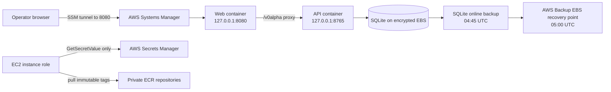

# Private AWS deployment

This directory deploys the current SQLite-first AdminBot application to one Amazon Linux 2023 EC2
instance. It intentionally does not expose an inbound port. Operators reach the web application
through an AWS Systems Manager Session Manager port-forwarding session; the API continues to bind
only to `127.0.0.1`.



## Why EC2 rather than ECS/Fargate

SQLite needs a single writer and local filesystem locking. Mounting it on network storage merely to
fit a horizontally scalable container platform would weaken the current persistence assumptions.
The application therefore runs as hardened Docker containers on one host and stores state on a
separate encrypted EBS volume. The volume is protected from Terraform destruction, survives instance
replacement, receives an online SQLite backup, and is captured daily by AWS Backup.

This is a deliberate v0alpha topology. A future multi-instance service should first move the shared
database boundary to PostgreSQL.

## Security properties

- The security group has no ingress rules. There is no SSH key or bastion.
- EC2 Instance Metadata Service v2 is mandatory and containers cannot reach instance credentials.
- The API's existing non-loopback refusal remains unchanged.
- EBS, AWS Backup, ECR, and Secrets Manager use a rotating customer-managed KMS key.
- The instance role can pull only the two AdminBot repositories and read only the AdminBot runtime
  secret.
- Terraform creates secret metadata but never a secret version, so plaintext secret values never
  enter Terraform configuration, plans, or state.
- Secrets are fetched at deployment time, strictly validated, written atomically to `/run` with mode
  `0600`, and passed to the API container through an environment file. They are not baked into either
  image.
- ECR tags are immutable and `latest` is rejected. Use the Git commit SHA as `image_tag`.
- Containers run read-only, with all Linux capabilities dropped, `no-new-privileges`, bounded PIDs,
  and only the API's state volume writable.

AWS documents that Session Manager requires no inbound ports and supports port forwarding, and AWS
recommends least-privilege Secrets Manager access and avoiding secret values in Terraform state:

- <https://docs.aws.amazon.com/systems-manager/latest/userguide/session-manager.html>
- <https://docs.aws.amazon.com/secretsmanager/latest/userguide/best-practices.html>
- <https://docs.aws.amazon.com/prescriptive-guidance/latest/terraform-aws-provider-best-practices/security.html>

## Prerequisites

- Terraform 1.8 or newer
- Docker with BuildKit
- AWS CLI v2 and Session Manager plugin
- AWS credentials allowed to create the resources in `main.tf`
- `openssl`, Python 3, and a UUID generator for local secret preparation

The AWS account must have AWS Backup available in the selected region. The default region is
`eu-west-2`; override it in `terraform.tfvars`.

## Provision infrastructure

Use an encrypted remote backend for any shared environment. Copy `backend.tf.example` to
`backend.tf`, replace its placeholders with a separately bootstrapped state bucket/KMS key, and do
not commit that edited file.

```bash
cd deploy/aws
cp terraform.tfvars.example terraform.tfvars
# Replace image_tag with the exact Git commit SHA and review all values.
terraform init
terraform fmt -check -recursive
terraform validate
terraform plan -out adminbot.tfplan
terraform apply adminbot.tfplan
```

The instance may initially report that it is waiting for images and a secret value. That is expected:
Terraform deliberately does not handle either secret plaintext or mutable image builds.

## Build and publish images

Run these commands from the repository root after Terraform has created ECR:

```bash
AWS_REGION=$(terraform -chdir=deploy/aws output -raw aws_region 2>/dev/null || printf 'eu-west-2')
API_REPOSITORY=$(terraform -chdir=deploy/aws output -raw api_repository_url)
WEB_REPOSITORY=$(terraform -chdir=deploy/aws output -raw web_repository_url)
IMAGE_TAG=$(git rev-parse HEAD)
ECR_REGISTRY=${API_REPOSITORY%%/*}

aws ecr get-login-password --region "$AWS_REGION" \
  | docker login --username AWS --password-stdin "$ECR_REGISTRY"
docker build --target api --tag "$API_REPOSITORY:$IMAGE_TAG" .
docker build --target web --tag "$WEB_REPOSITORY:$IMAGE_TAG" .
docker push "$API_REPOSITORY:$IMAGE_TAG"
docker push "$WEB_REPOSITORY:$IMAGE_TAG"
```

The `image_tag` Terraform variable and pushed tag must match. For repeatable releases, build from a
clean checkout of that exact commit.

## Configure runtime secrets

Use the durable organization UUID already associated with the data being deployed. When deploying
the locally migrated database, it must be the same `ADMINBOT_ORGANIZATION_ID`; generating a second
UUID would place the accounts outside the API's organization boundary.

The helper generates a new high-entropy identity key and submits a temporary JSON file through the
AWS CLI. It never prints either secret value and securely removes the temporary file when the local
platform supports `shred`.

```bash
cd deploy/aws
./configure-secret.sh \
  "$(terraform output -raw runtime_secret_arn)" \
  "<durable-organization-uuid>"
```

Do not put vendor tokens into this secret. Add a narrowly scoped connector-specific secret and IAM
permission only when that connector is implemented. The current secret accepts exactly:

- `ADMINBOT_ORGANIZATION_ID`
- `ADMINBOT_IDENTITY_KEY_SECRET`

## Start or update the application

After publishing the images and populating the secret, open an SSM shell and run the installed,
idempotent deploy command:

```bash
aws ssm start-session \
  --region eu-west-2 \
  --target "$(terraform -chdir=deploy/aws output -raw instance_id)"

sudo /usr/local/sbin/adminbot-deploy
sudo systemctl status adminbot-api adminbot-web adminbot-sqlite-backup.timer
```

The deploy command refreshes the secret, obtains a short-lived ECR login, pulls both immutable
images, restarts the services, and requires the private web health endpoint to become ready.

## Open the private UI

Run the exact command returned by `terraform output -raw ssm_port_forward_command`, then open
<http://127.0.0.1:8080>. Keep the SSM session running while using the application.

## Data and restore boundary

Terraform does not upload ignored local SQLite files. Moving the locally migrated database to AWS
contains personal and authentication data and must be a separate, explicitly authorized operation
performed during a write freeze. Do not put it in an image, Terraform state, user data, or a public
object-storage URL.

The API container performs committed Prisma migrations before starting. Every day it creates an
online SQLite backup under `/srv/adminbot/state/backups`; AWS Backup snapshots the encrypted EBS
volume shortly afterward. Test restoration into a separate volume and instance before treating this
as a production recovery plan.

The KMS key, secret, and state volume use `prevent_destroy`. A normal `terraform destroy` will stop
instead of deleting them. Removing those guards is a manual data-retention decision, not a routine
deployment action.
