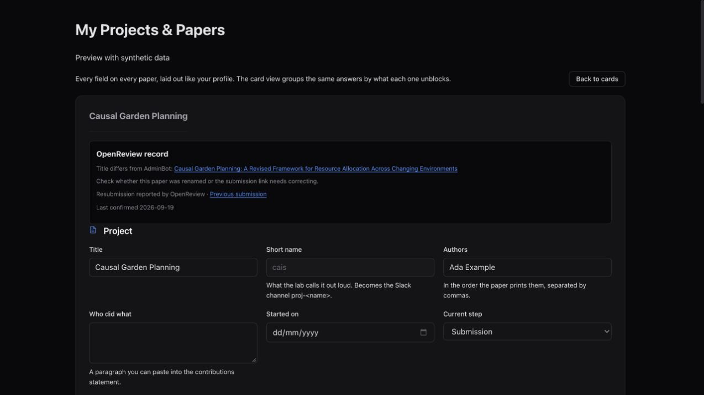
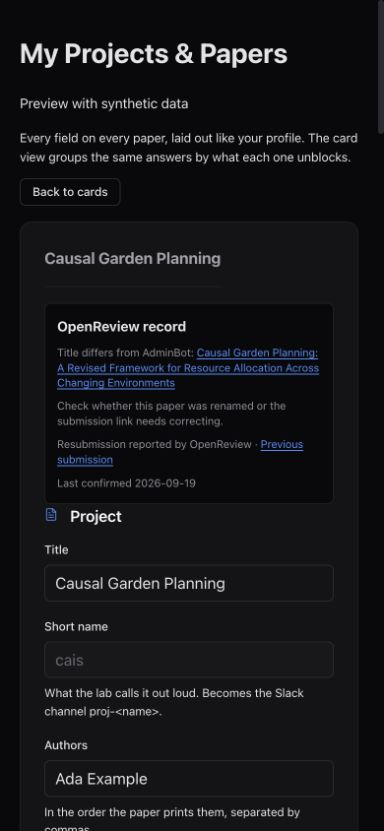

# OpenReview identity on paper cards

The existing hourly paper-evidence pass reads the exact OpenReview submission linked in
the paper's submission slot. It uses the public API anonymously. Successful reads store
the public title and the optional ARR `previous_url` submission ID in the existing SQLite
slot table. Existing verified slots without metadata are backfilled on the next pass;
successful metadata is refreshed after 24 hours.

Both the paper card and the flat paper form show:

- The linked OpenReview title, flagging differences from the AdminBot title after ignoring
  case, punctuation, and spacing. This is a prompt to check the title or link, not an
  accusation of an incorrect submission.
- “Resubmission reported by OpenReview” and a previous-submission link only when the
  public record explicitly provides one. Otherwise history is **unknown**.
- The last successful check date. A private or unavailable record is not invalidated.

Changing or clearing a submission URL removes its old verification metadata. A slow
response cannot overwrite a link edited while the request was outstanding. No papers
are renamed, merged, or matched by fuzzy title search.

This does not discover all resubmissions: venues can omit the field, hide it during review,
or use different forms. It does not use reviewer credentials or retrieve earlier papers.
The first read happens when the existing `/papers/evidence/verify/run` job runs; this
requires deploying the backend as well as the UI.

API semantics: [OpenReview note IDs and forums](https://docs.openreview.net/getting-started/objects-in-openreview/introduction-to-notes).
Resubmission evidence: [ARR's Previous URL field](https://aclrollingreview.org/reviewerguidelines#how-to-review-resubmissions).

The screenshots below render the real flat-paper component with production styles and
synthetic data. They are local component previews, not screenshots of live lab records.

