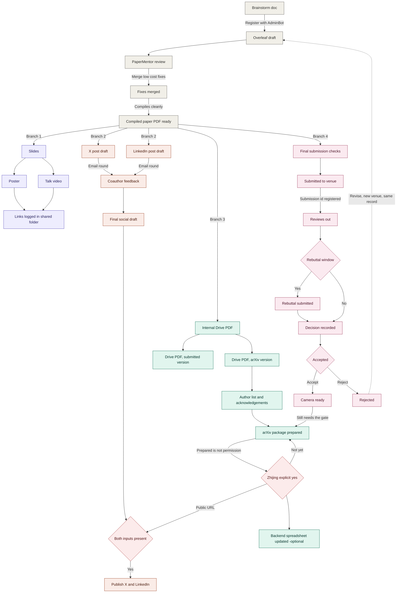

# Nudge Logic — a stateless frontier resolver over the PaperFlow DAG

Module spec. Node ids are **PaperFlow's own** (`BR`, `OV`, `PM`, …) so the nudger and the chart
share one vocabulary — no mapping table, nothing to drift.

Design contract:

- Model the workflow as a **DAG** of actionable nodes and predecessor–successor dependencies.
- Keep the nudger **stateless and read-only**; the backend is the single source of truth for completion.
- Nudge only **frontier** nodes: incomplete nodes whose predecessors are all complete.
- For blocked tasks, **traverse upstream** to the actual actionable dependency — never nudge the blocked task.
- **Route by dependency type**: missing predecessors, approval gates, newly unblocked successors.

---

## 0. The one rule everything else rests on

PaperFlow as drawn is **not** a DAG. Tracing all edges, there are exactly two cycles:

| # | Cycle | Length | Kind |
|---|---|---|---|
| C1 | `OV → PM → FX → PDF → CK → SB → RV → RB → DC → AC → RJ ⤴ OV` | 11 nodes | **RESET** — "Revise, new venue, same record" |
| C2 | `PK → GT ⤴ PK` | 2 nodes | **RETRY** — "Not yet" |

Nothing else loops. `CM → PK` looks like it might, but `PK`'s descendants (`GT`, `JN`, `BE`, `PS`)
never reach `CM`.

Both are **control edges, not dependency edges** — they mean *"go round again"*, not *"this is
required first"*.

> **Rule 0 — cycle-breaking.**
> Predecessor traversal follows `REQUIRES` and `GATE` edges only.
> `RESET` (`RJ→OV`) and `RETRY` (`GT→PK`) are **never** traversed upstream.

With Rule 0 the dependency graph is acyclic, the frontier is well-defined, and the upstream
recursion provably terminates. Rule 0 is not a convenience — without it the other four principles
have no meaning.

---

## 1. The graph

PaperFlow, minimally revised. Two changes from the original, both in §6: `ZP` removed, and its two
inbound edges rewired to `PK` — which makes `PK` an OR-join. That semantic is carried in the
overlay table below, not on the node, so the chart stays clean.



Colour is **branch identity** — your palette, unchanged. The nudge class is a separate overlay:

| Nudge class | Nodes | Nudged? | Recipient |
|---|---|---|---|
| `ACTION` | BR OV PM FX PDF SL PO TV XD LI CP SF DR DA AK CK SB RS DC CM | yes | the node's owner |
| `OR-join` | **PK** — `AK` *or* `CM`, either alone suffices | yes | first author |
| `APPROVAL` | **GT** — the only one | yes | **Zhijing — never the author** |
| `JOIN` (AND) | **LG, JN** | **never** | resolves through to missing predecessors |
| `EXTERNAL_WAIT` | **RV, RB, AC** | never for the outcome | observation nudge only, past due date |
| `OPTIONAL` | **BE** | once, low priority | admin — can never block anything |
| `TERMINAL` | DS, PS, RJ | never | — |

Owners: `CP` → **coauthors**; `GT` → **Zhijing**; `BE` → **admin**; everything else → **first author**.

The four branches off `PDF` are **genuinely parallel** — no edge crosses between branches 1, 2 and
3, and branch 4 rejoins only at `PK`. That is what lets the frontier hold several live nudges at
once, and what makes a rejection survivable: branches 1–3 keep their progress.

Two chart labels are specifications, not commentary:

- **`PK -->|Prepared is not permission| GT`** — preparing the package must never auto-satisfy the
  gate. `GT` flips only on Zhijing's explicit act.
- **`GT -->|Not yet| PK`** — returns `PK` to incomplete. A retry, not a failure, and not a dependency.

---

## 1a. Cliff register

### Reset and prune scopes

What a rejection touches, and what it must not:

| Scope | Nodes | On `RJ` |
|---|---|---|
| **Survives** — work stays valid | branch 1 `SL PO TV LG` · branch 2 `XD LI CP SF` · branch 3 `DR DS DA AK` | untouched |
| **Re-opened** for revision | `OV PM FX PDF` | back to `INCOMPLETE` |
| **Reset scope** — cleared per attempt | `CK SB RV RB RS DC AC CM RJ` | cleared, attempt *n+1* |
| **Pruned** per attempt, recomputed never sticky | `AC = Reject ⇒ CM is N/A` · `RB = No ⇒ RS is N/A` | recomputed each tick |

### The register

Each row is a state the graph can actually reach. **Symptom** is what a naive frontier
implementation does; **rule** is the mitigation.

| # | Trigger | Symptom without the rule | Rule |
|---|---|---|---|
| **Cycles** | | | |
| 1 | `resolve(PS)` walks `JN → GT → PK → GT …` | infinite recursion | Rule 0 + visited set |
| 2 | every node in C1 has an incomplete ancestor | frontier empty while work is obviously available | Rule 0 |
| 3 | rejection resets *everything* | slides, social copy, Drive PDFs destroyed | reset **scoped** to the venue subtree |
| 4 | rejection resets *nothing* | sits `RJ`-terminal forever, frontier empty, false "done" | `RJ` opens attempt *n+1*; terminal **only for that attempt** |
| 5 | `GT` says "Not yet", `PK` flips back | looks like lost data | status **attempt-scoped**; nudge carries the reason |
| **Joins** | | | |
| 6 | `JN` / `LG` on the frontier | nudge says "have both inputs present" — unactionable | joins are **never** nudged |
| 7 | `resolve()` returns the first missing predecessor | one side of `JN` fed, the other starves forever | `resolve()` returns a **set** |
| 8 | `JN` spans branch 2 and branch 3 | `SF` owner thinks they're done, doesn't know they wait on Zhijing | routing names the **sibling's** state |
| **Pruning** | | | |
| 9 | `AC = Reject` | `CM` stays `INCOMPLETE` → nudged forever on a dead branch | `N/A` status |
| 10 | `RB = No` | `RS` stays `INCOMPLETE` → same | `N/A` status |
| 11 | `CM` is `N/A` and the arXiv path needs it | branch 3 deadlocks permanently, silently | **RESOLVED** — `PK` is `ANY_OF`, preprint path via `AK` suffices (§6) |
| 11b | `PK` done for the preprint, then `CM` arrives | camera-ready never gated — `GT` silently skipped | `PK` and `GT` scoped **per version**; a new version re-arms both (§6) |
| 12 | `N/A` stored as sticky | attempt 2 can never reach `CM` — silent, permanent | prune **recomputed each tick**, never persisted |
| **Approval** | | | |
| 13 | `PK` complete treated as `GT` satisfied | arXiv posts without permission | gate flips **only** on the approver's explicit act |
| 14 | `GT` nudge sent to the author | author can't act; real blocker invisible | route to the **approver** |
| 15 | Zhijing away, `GT` pending | `JN PS BE` stall; frontier re-nudges the same person daily | cadence cap **and** — see 16 |
| 16 | escalation path is `escalate_to_pi` but the blocker **is** the PI | escalating the PI to themselves | notify the **author** + admin board; do **not** escalate |
| 17 | ~~two gates in series, same approver~~ | ~~"I already approved this"~~ | **ELIMINATED** — `ZP` removed in §6 |
| **External wait** | | | |
| 18 | `RV` / `RB` nudged to produce the outcome | asks someone to make the venue respond | never nudge for the **outcome** — but see 20 |
| 19 | `RB` deadline passes | irreversible, the window closes | deadline escalation fires **before**, not after |
| 20 | venue posts reviews, nobody records `RV` | `RB DC AC CM RJ` all freeze silently — 7 of 31 nodes | past the expected date, nudge to **observe**: "did reviews come out?" |
| 21 | venue silent, `RV` pending, all else done | frontier empty, no terminal → **false stall alert** | `WAITING_EXTERNAL` is a distinct status |
| **Volume** | | | |
| 22 | `PDF` fans out to 4 branches, one owner | 4 nudges at once, same person | batch per recipient into one message |
| 23 | first author owns ~20 nodes | constant noise, nudges get muted | rank by deadline and critical path; branch 4 outranks branch 1 |
| 24 | `DS` is a leaf blocking nothing | nagged forever with zero consequence | finite nudge count, then admin board |
| **Ownership and semantics** | | | |
| 25 | a node has no owner | silently skipped — the step never happens | **config error, zero nudges, fail loud** |
| 26 | `CP` owned by "coauthors" plural | diffusion of responsibility | exactly **one accountable** owner, others cc'd |
| 27 | `BE` treated as a normal node | an optional spreadsheet blocks publication | `OPTIONAL` never blocks, never escalates |
| 28 | `RB` / `AC` treated as completable tasks | someone nudged to "complete" a decision | decisions **derived** from the recorded outcome |
| 29 | empty frontier read as success | a broken graph looks identical to a finished paper | three-way split — see §2 step 6 |
| 30 | nobody logs anything, nudges keep firing | author mutes; the real deadline nudge is missed too | auto-detect evidence-backed nodes — see below |

### Evidence-backed nodes — do not ask a human

The chart names its own artifacts. These should be detected, never self-reported:

| Node | Evidence |
|---|---|
| `SB` | "Submission id registered" |
| `GT` | "Public URL" exists |
| `LG` | links present in the shared folder |
| `DS`, `DA` | the Drive file exists |

What genuinely needs a human: `GT` (judgment), `CP` (coauthor replies), `RV` (observation).

### The five principles, and what each needs to survive contact

| Principle | Needs |
|---|---|
| Model as a DAG | Rule 0 — without it there is no DAG (1, 2) |
| Stateless, backend is truth | attempt-scoped status, recomputed pruning (5, 12) |
| Nudge only frontier nodes | `N/A` and `WAITING_EXTERNAL` as first-class statuses (9, 10, 21) |
| Traverse upstream | `resolve()` returns a **set**, visited-guarded (1, 7) |
| Route by dependency type | approver ≠ author, join siblings named, PI-is-blocker case (8, 14, 16) |

---

## 2. The resolver

Stateless pipeline, run per tick — cron cadence, a completion event, or "why is X stuck".

1. **Load** — read the paper record and per-node status from the backend. Store nothing.
2. **Validate** — every `ACTION` owned, every node reachable from `BR`, every node reaches a
   terminal, acyclic over `REQUIRES`+`GATE`. Invalid ⇒ **admin alert, zero nudges emitted.**
3. **Prune** — apply decision outcomes, mark untaken branches `N/A`. Recomputed, never persisted.
4. **Entry** — scheduled sweep goes straight to step 5; a named blocked task goes through §4 first.
5. **Frontier** — compute per §3.
6. **If the frontier is empty**, three-way split — never one:
   - a terminal is complete ⇒ **done**, no nudge
   - something is `WAITING_EXTERNAL` ⇒ **quiet**, the venue owns the clock
   - otherwise ⇒ **stall alert to admin**. Silence must never be ambiguous.
7. **Classify and route** each frontier node per §5. `JOIN` or `EXTERNAL_WAIT` appearing as a
   frontier leaf is an assertion failure — report it as a graph bug, then resolve through.
8. **Batch** — per recipient, dedupe and collapse into one message; cap one nudge per
   node+recipient per window; respect quiet hours.
9. **Emit proposals only** — `paper_publish.nudge_author`, `escalate_to_pi`, `member_nudge.send`.
   The nudger never sends; the existing propose → approve → execute → audit gate does.

## 3. Frontier

```
frontier(G, status) =
  { n ∈ G.nodes :
        status(n) == INCOMPLETE
    ∧   status(n) ≠ N/A
    ∧   ∀ p ∈ preds_REQUIRES_GATE(n) : status(p) == COMPLETE }
```

`preds_REQUIRES_GATE` excludes `RJ→OV` and `GT→PK` (Rule 0).

## 4. Upstream resolution

```
resolve(n, visited = ∅):
  if n ∈ visited                       → ∅        # guard, unreachable given Rule 0
  if status(n) ∈ {COMPLETE, N/A}       → ∅
  visited ← visited ∪ {n}
  missing ← { p ∈ preds(n) : status(p) ∉ {COMPLETE, N/A} }
  if missing == ∅                      → { n }    # n itself is the frontier
  else                                 → ⋃ resolve(p, visited) for p ∈ missing
```

Returns a **set**, never a single node — an AND-join legitimately has several actionable ancestors
and every one must be nudged.

**Worked example.** Someone asks why `PS` (Publish X and LinkedIn) is stuck.
`resolve(PS)` → `JN` incomplete → missing `{SF, GT}` → `resolve(SF)` walks back to `CP` (coauthor
feedback outstanding), `resolve(GT)` stops at `GT` if `PK` is done.
Result: **nudge the coauthors about `CP`, and nudge Zhijing about `GT`.** Nobody nudges `PS`, and
nobody nudges the author, who has nothing to do.

## 5. Routing

| Situation | Recipient | Message must carry |
|---|---|---|
| frontier `ACTION` | node owner | the step + **which successors it unblocks** |
| frontier `APPROVAL` (`GT`) | Zhijing | which version, what is prepared, what the yes releases |
| AND-join missing 1 of 2 (`JN`, `LG`) | owner of the missing side | that the other side is **already waiting** |
| AND-join missing 2 of 2 | both owners, separately | each other's state |
| `EXTERNAL_WAIT` past due (`RV`, `RB`) | first author, then PI | "did reviews come out?" — observation, not production |
| newly unblocked after a completion | new frontier owners | "X just finished — you are up" |
| `OPTIONAL` (`BE`) | admin, once | explicitly marked non-blocking |

## 6. The three revisions to the chart

### 6.1 `ZP` (Zhijing review) removed — one approver touchpoint, not two

`ZP` and `GT` were both Zhijing, back to back: review the author list, then explicitly permit the
post. That doubles the PI's involvement on one branch and creates a second stall point on the
busiest person in the graph. `GT` already means "Zhijing looked and said yes".

```
before:  AK ──"request senior pass"──▶ ZP ──▶ PK ──"prepared is not permission"──▶ GT
         CM ──"still needs the gate"──▶ ZP

after:   AK ─────────────────────────────▶ PK ──"prepared is not permission"──▶ GT
         CM ──"still needs the gate"──────▶ PK
```

Eliminates cliff 17 outright.

**The trade-off, stated plainly:** the author list is no longer checked *before* the package is
built — a wrong author list is caught at `GT`, after the work. The `GT → PK` "Not yet" loop is what
absorbs this. Cost: one wasted package prep. Benefit: halving Zhijing's involvement. If the rework
proves expensive, the fix is a checklist item on `AK`, **not** a second gate node.

### 6.2 `PK` is `ANY_OF` (OR-join)

`PK` now has two inbound edges: `AK` (preprint) and `CM` (post-acceptance).

**Decision: OR** — arXiv release does not require acceptance, so the preprint path must carry the
branch alone. AND would mean `AC = Reject` prunes `CM` and deadlocks branch 3 permanently and
silently. That was the one true structural deadlock in the graph.

### 6.3 The sub-cliff OR introduces

An OR-join already satisfied swallows the second request:

```
preprint:  AK complete → PK built → GT yes → arXiv posted
accepted:  CM complete → "still needs the gate" → PK is ALREADY complete
           → the camera-ready version is never gated
```

> **Rule: `PK` and `GT` are scoped per version, not per paper.**
> A new version arriving on either inbound edge **re-arms both**. Done for the preprint does not
> mean done for the camera-ready, and the nudge must name which version it asks about.

Same versioning the `GT → PK` retry loop already needs — one mechanism, not two.

## 7. Anti-cliff invariants

1. `RESET` and `RETRY` are never traversed upstream. *(Rule 0.)*
2. `LG` and `JN` are never nudged — joins always resolve through.
3. No node is nudged while any predecessor is incomplete.
4. Untaken branches are `N/A`, never `INCOMPLETE`. Dead branches emit zero nudges.
5. `GT` flips only on Zhijing's explicit act — **prepared is not permission**.
6. `BE` never blocks a successor and never escalates.
7. `RV`/`RB` never nudge for the outcome — but **do** nudge to observe it past the due date.
8. Every `ACTION` has exactly **one accountable** owner. Unowned ⇒ config error, fail loud.
9. One nudge per (node, recipient) per window; batch per recipient.
10. Empty frontier ∧ no terminal ∧ nothing `WAITING_EXTERNAL` ⇒ **stall alert**, never silence.
11. `RJ → OV` re-opens the **venue subtree only**; branches 1–3 survive.
12. Invalid graph emits **zero** nudges rather than partial ones.
13. Pruning recomputed every tick, never persisted.
14. Node status is **attempt- and version-scoped**.
15. When the blocked node's approver **is** the PI, notify the author and the admin board.
16. A leaf that blocks nothing (`DS`) gets a finite nudge count, then the admin board.
17. Evidence-backed nodes are auto-detected, never asked of a human.

## 8. Why stateless holds

The module needs only `(graph, status_map)` at tick time and emits only proposals.

- Re-running at any moment yields the same answer — restarts, redeploys and double-fired timers are
  harmless.
- The only mutable thing is the **cadence ledger** (who was nudged about what, when). That is
  suppression bookkeeping, not workflow state: losing it causes a duplicate nudge, never a missed
  step and never a wrong one.
