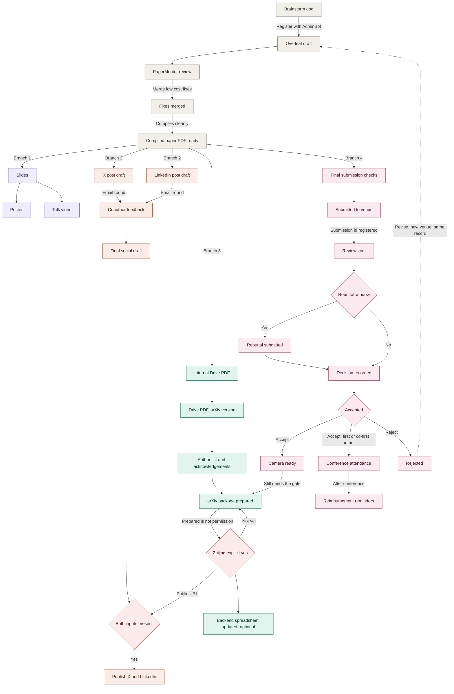

# PaperFlow — revised

## Conference attendance — what `CA` covers

Triggered on acceptance, for the **first author or a co-first author**. All of it runs in
parallel with camera ready, not after it — flights and hotels get expensive if this waits.

- Read the reimbursement policy in the guidebook **first**, before booking anything
- Register for the conference, book flight and Airbnb or hotel
- Create or join the conference Slack channel — format `#conf-icml-2026`
- *Optional but suggested:* coordinate with other members on shared flight times and
  Airbnb, so the trip doubles as team building
- Early user: Memo (for COLM)
- Use *Jinesis Lab: Quick Pointers of Research in 2026* extensively

`RM` fires **after** the conference, not before — that is the whole reason it is a separate
node rather than a bullet on `CA`. Reimbursement can only start once the receipts exist.
