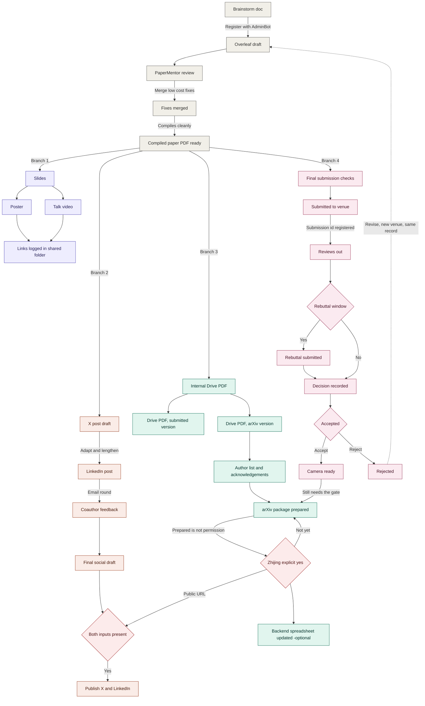

# PaperFlow — revised

```mermaid
%% Revised from the original. Two changes, both in the arXiv branch:
%%   1. ZP [Zhijing review] removed — Zhijing's involvement halves to one gate, GT
%%      (also dropped from the `rel` class list)
%%   2. both of ZP's inbound edges (AK, CM) now land on PK
%% PK therefore has two inbound edges and is an OR-join: AK alone OR CM alone is enough.
%% This matters because a reject prunes CM — under AND, branch 3 would deadlock
%% permanently and silently, and the preprint could never be posted.
flowchart TD
    BR[Brainstorm doc] -->|Register with AdminBot| OV[Overleaf draft]
    OV --> PM[PaperMentor review]
    PM -->|Merge low cost fixes| FX[Fixes merged]
    FX -->|Compiles cleanly| PDF[Compiled paper PDF ready]

    PDF -->|Branch 1| SL[Slides]
    PDF -->|Branch 2| XD[X post draft]
    PDF -->|Branch 3| DR[Internal Drive PDF]
    PDF -->|Branch 4| CK[Final submission checks]

    SL --> PO[Poster]
    SL --> TV[Talk video]
    PO --> LG[Links logged in shared folder]
    TV --> LG

    XD -->|Adapt and lengthen| LI[LinkedIn post]
    LI -->|Email round| CP[Coauthor feedback]
    CP --> SF[Final social draft]

    DR --> DS[Drive PDF, submitted version]
    DR --> DA[Drive PDF, arXiv version]
    DA --> AK[Author list and acknowledgements]
    AK --> PK[arXiv package prepared]
    PK -->|Prepared is not permission| GT{Zhijing explicit yes}
    GT -->|Not yet| PK
    GT -->|Public URL| JN
    GT --> BE[Backend spreadsheet updated -optional]

    CK --> SB[Submitted to venue]
    SB -->|Submission id registered| RV[Reviews out]
    RV --> RB{Rebuttal window}
    RB -->|Yes| RS[Rebuttal submitted]
    RB -->|No| DC[Decision recorded]
    RS --> DC
    DC --> AC{Accepted}
    AC -->|Accept| CM[Camera ready]
    AC -->|Reject| RJ[Rejected]
    CM -->|Still needs the gate| PK
    RJ -.->|Revise, new venue, same record| OV

    SF --> JN{Both inputs present}
    JN -->|Yes| PS[Publish X and LinkedIn]

    classDef pres fill:#EEEDFE,stroke:#534AB7,color:#26215C
    classDef soc fill:#FAECE7,stroke:#993C1D,color:#4A1B0C
    classDef rel fill:#E1F5EE,stroke:#0F6E56,color:#04342C
    classDef conf fill:#FBEAF0,stroke:#993556,color:#4B1528
    classDef gate fill:#FCEBEB,stroke:#A32D2D,color:#501313
    classDef hub fill:#F1EFE8,stroke:#5F5E5A,color:#2C2C2A

    class BR,OV,PM,FX,PDF hub
    class SL,PO,TV,LG pres
    class XD,LI,CP,SF,PS soc
    class DR,DS,DA,AK,PK,BE rel
    class CK,SB,RV,RB,RS,DC,AC,CM,RJ conf
    class GT,JN gate
```
